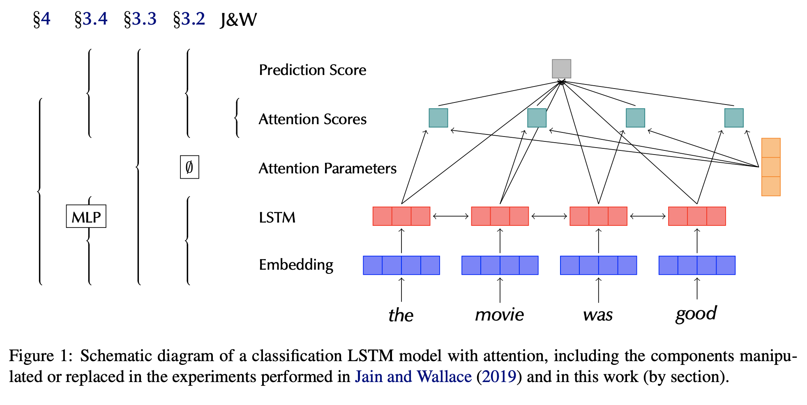
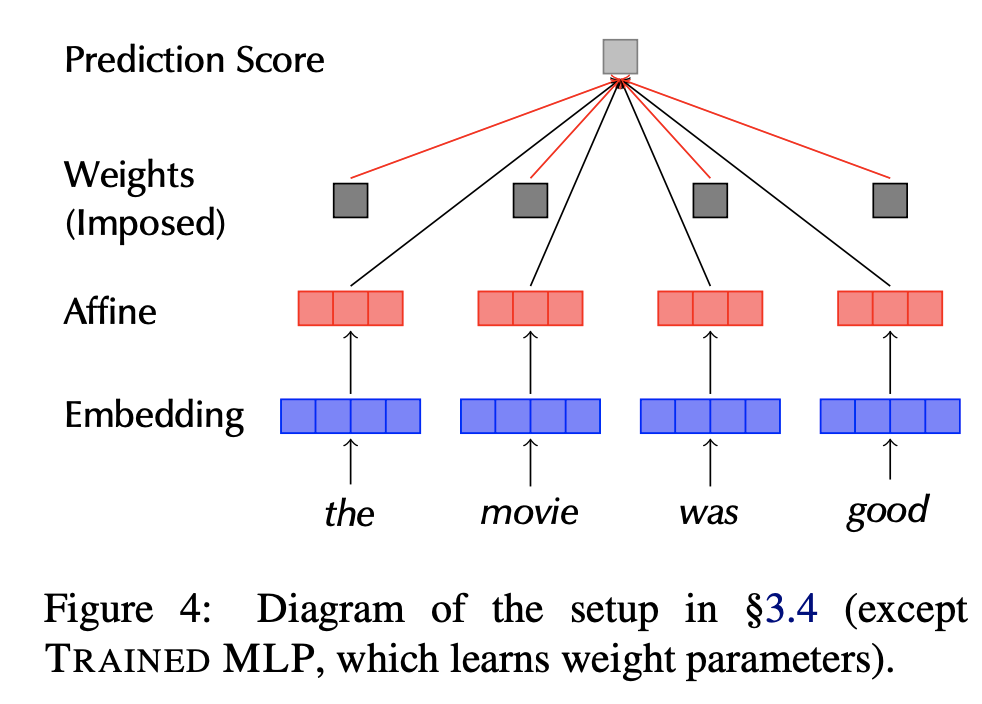
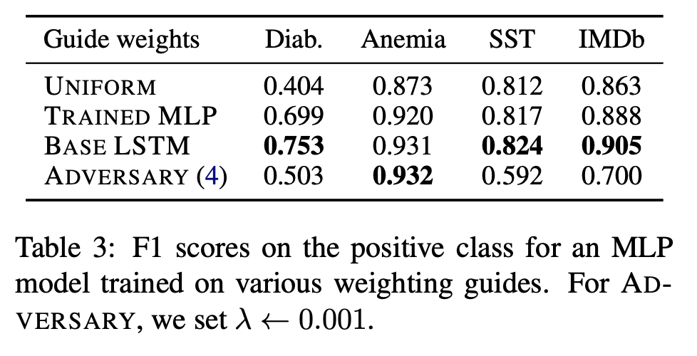

## Attention is not not Explanation
### Sarah Wiegreffe, Yuval Pinter
### EMNLP 2019

**Whats New** This paper dissects the assumptions made in other paper "attention is not explanation", and gives more plausible way of modeling the problem and experimental setup. 

**Preface: Jain & Wallace paper**
* Key Ideas: 
    * Consitency with feature importance
    * Exlusivity to produce Prediction 
* **Loopholes in assumptions**
    * Experiments looked covincing for desired consistency of attentions with feature importance.
    * Detaching attention distribution and output layer of pretrained network from the parameters that computes them
    * Treating attention score as a standalone unit
    * Computing independent adversarial distribution for each "instance"
    * Binary classification is mathematically flexible problem, where prediction is reduced to a single scalar, and when experiments are conducted on individual instances, No surprise, exclusivity can not be expected.

**Key contributions**
* Uniform Weights Baseline: Is attention needed? 
    * In order to understand if there is a need of attention to solve the problem, author produces "Uniform Weights Baseline"
    * Many datasets produces good results even with uniform attentions, those datasets can be ignored from study here.
* Expected variance Variance calibration based on multiple seed runs
    * There is some amount of JS Divergence in attention weights found just because of random seed weights, so these are expected variances. It also depends on dataset and problem.
* Diagnostic framework using frozen weights from pre-trained models
    * Author tried to fix loopholes in assumption and experiment setup.
    * Author enforce the attention weights distribution learnt baseline and adversarial method, and it applys over independent diagnostic model. As, its also not advisable to replace standalone attention weights in LSTM-attn model, as attention weights are not learnt in standalone fashion
    * Following two figures would give complete illustration of the process, and comparative results can be seen in the table
       

        
        <em>Source: Author</em>
        

        

        
        <em>Source: Author</em>
        

        

        
        <em>Source: Author</em>
        

* End-to-end Adversarial Traning Protocol
    * As shown in the figures above, diagnostic setup was laid. Following loss function was minimized over all dataset.

        

    * Attention distributions learnt from adversaries fails poorly on diagnostic framework.

    

