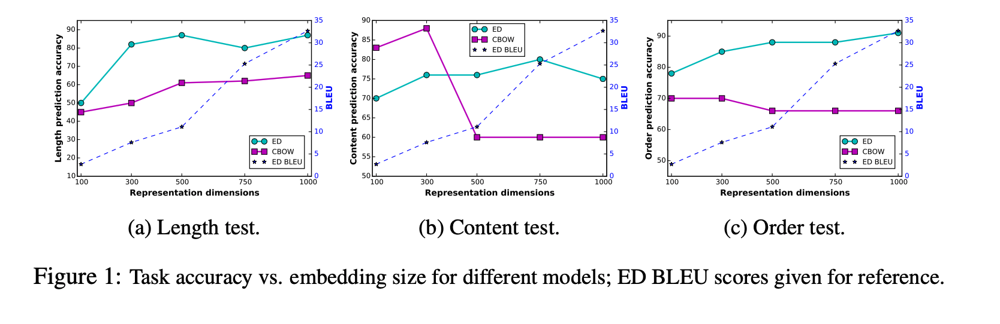
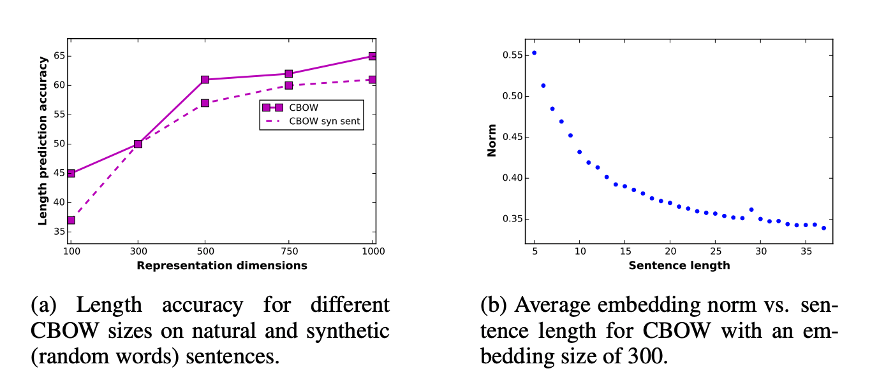
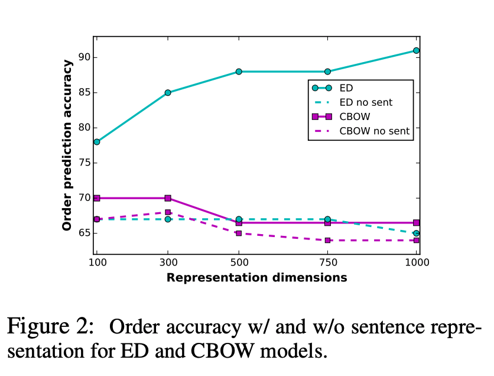
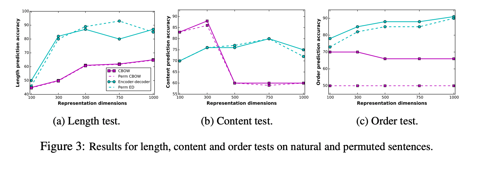
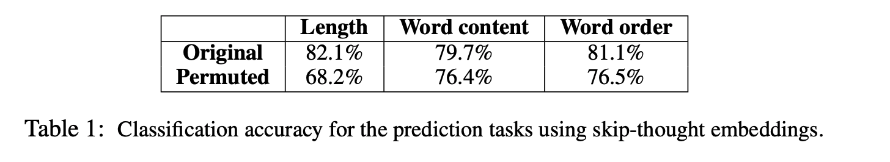

## Fine-Grained Analysis of Sentence Embedding Using Auxiliary Prediction Tasks
### Yossi Adi, Yoav Goldberg et al, 
### ICLR 2017 [[arXiv](https://arxiv.org/pdf/1608.04207.pdf)]

**Whats New**
One of the early paper to laid foundation on experimentation setup for auxiliary task prediction, it investigates how three different techqniques of sentence embeddings captures langauge information. 

**How It Works**
* Mainly two different popular sentence embeddings were considered
    * CBOW based average of word embeddings over a sentence
    * LSTM encoder decorder, with training objective of auto-encoding.

* Three auxiliary tasks were considered
    * Length Task - given a sentence embedding, can we get length of a sentence?
    * Content Task - given a sentence embedding and a word embedding, task is to determine if word is part of the sentence? 
    * Order Task - given two word embeddings and a sentence embedding, goal is to determine if w1 is appears before w2 in sentence s.

* Experiments:
    * We can see how both the model at varying complexity produces results for these three tasks.

    

    
    <em>Source: Author</em>
    

    **How CBOW captures sentence length**
    * Synthetic dataset was created, where each word in a sentence was replaced by a random word.
    * But, that did not impact the performance of the CBOW model, hence the source of knowledge is not the identity of those words or coherancy of those occuring as a sentence. But it could be something else. An explorative study reveals that it was highly correlated to norm of the sentence embedding.

    

    
    <em>Source: Author</em>
    

    **How CBOW captures words order**
    * As a control task, it was compared without sentence embedding. If CBOW and ED models are capturing word order because of sentence embeddings, or its just expressive in word representations directly?
    * CBOW performance remained similar, wheras ED performance impacted dramatically. Hence, CBOW just depends on natural word statistics captured in word embeddings, but ED acutally learns word order in sentence embeddings.

    

    
    <em>Source: Author</em>
    

    **How important is English word order for encoding sentences?**
    * Synthetic dataset was created by permuting sentences randomly. 
    * Length and Content taks performance remains similar, but the order task for CBOW failed badly, CBOW could not get adapted to this new synthetic dataset, so it relys more on the natural english order captured in embeddings, where ED is actually learning the order from the data, and it is general purpose, so it could get adjusted to permuted dataset.

    

    
    <em>Source: Author</em>
    

    **Skip Thought Vectors**
    * On permulated synthetic dataset, all the three tasks were run, and it is found taht skip thought vectors dropped heavily on all these trhee. That means skip thought vectors is actually tring to learn english natural knowledge.

    

    
    <em>Source: Author</em>
    

    