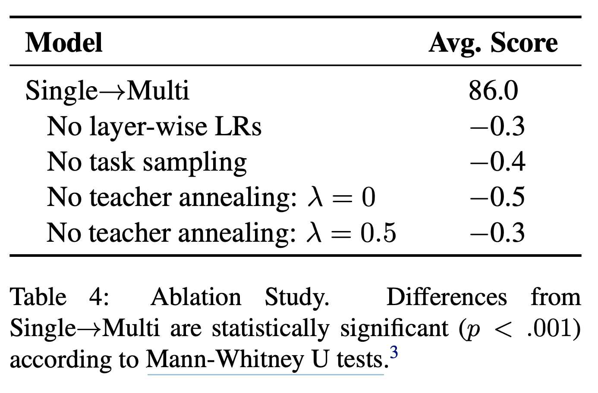
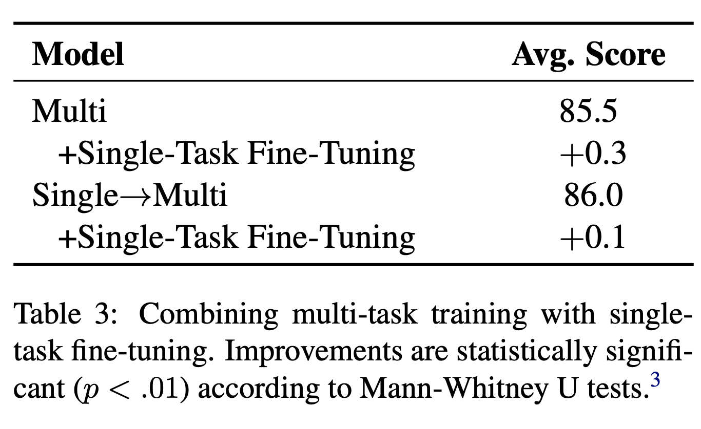

## BAM! Born-Again Multi-Task Networks for Natural Language Understanding

### Kevin Clark, Minh-Thang Luong, Urvashi Khandelwal, Christopher D. Manning, Quoc V. Le

### Standord, Google Brain, 2019

**Whats New** Generally it is challaning for multi task neural network models to outperform single task fine tuned models. Where this paper shows it is possible.

**How it works** This paper gives series of tricks, which makes Mutli Tasks networks can outperform single task tuned networks. Those techniques are:
* Mutli Task Knowledge Distillation

    

    * Loss function aggregate loss over each task T, where labels comes from teacher model with parameters \theta_t

* Teacher Annealing

    

    * As can seen \lambda parameters control wightage between teacher model outcome, and gold label

* Layer wise learning rate

    * This technique is from Howard (2018), where lower layer (close to input) has lower learning rates. the learning rate for a particular layer d is set to BASE_LR · α^d

* Task Sampling
    
    * the probability of training on an example for a particular task τ is proportional to |Dτ |^0.75

* Ablation studies
    * It shows how each of above techniques are helping out.

        

        
        <em>Source: Author</em>
        

    * It also shows, relative improvement of a model trained on multi tasks and followed by single task fine tuning vs model BAM multi task model followed by single task fine tuning, where it establish the point that most of the gain related to single task fine tuning are already captured by BAM-multi task model.

        

        
        <em>Source: Author</em>
        

    * Similar tasks help out each other, and they also regularise each other. Let say, RTE has very less numbers of samples, but when it is fined tuned with MNLI it has huge gain, and marginal gains are also obsevered with other tasks. BAM-multi-tasks leverage all tasks. 
        

        
        <em>Source: Author</em>
        

    * It does Mann-Whitney U tests for ablation study.
