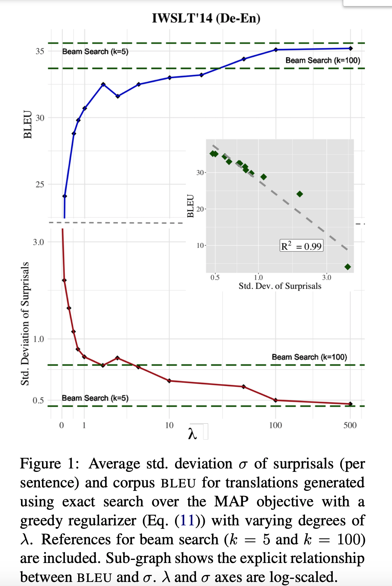

## If Beam Search is the Answer, What was the Question
### Clara Meister, Tim Vieira, Ryan Cotterell
### Oct 2020, EMNLP [[arXiv](https://arxiv.org/pdf/2010.02650.pdf)]

**Whats Unique**
In practice, beam-search works very effectively which gives an opportunity to make sub-optimal decisions at each step, however the objective function tries to minimise the global probability, which sometime can cause meaningless or empty string generation.

**How It Works**
* It is the concept of congintive science and information theory that human tries to spread information uniformly in the sentence. Which avoids surprises. 

* Information is defined as the negative log-probability in the information theory.

* UID (uniform information density) - this can be a good regulariser to modify the text decoding objective.

* Normally, decorder use following function to learn text generation.

    

* This is commonly known as Maximise a posteriori (MAP) decoding. And solving this problem with RNN is NP Hard. Therefore decoding is generally performed with heuristic method such as greedy exact search, or beam search.

* Beam Search - it is a pruned breath first search, where at every step maximum k hypothesis are expanded.

    
    * Where operator P_theta (Y'|x) is overloaded, as Y' is the set of hypothesis.
    * It is defined as the product of probability for each hypothesis. P_theta (y1 | x) * P_theta (y2 | x) * ..

* Decoding can be regularised with additional regulariser
     

* Basic idea is to keep reducing the new information which gets added at each step, we can derive it as follow
    * New information expressed at time t, 

        

    * Now we can derive greedy decoding with the following objective.

     

    where, the idea is to minimize the new information (or maximize the probability) at each step.

    * We can write decoding objective for beam search as follow: 

    

    * where, we can formulate regularizer as follow:

    

    * Operator u_t which was defined for unique hypotheis, have been overloaded for the set of hypothesis as following: 
    
    

* Following figure illustrate, how a with varying lambda values, how an objective can generate a greey decoding, and how greedier decoding will have lesser surprisals. 

    
    <em>Source: Author</em>
    

