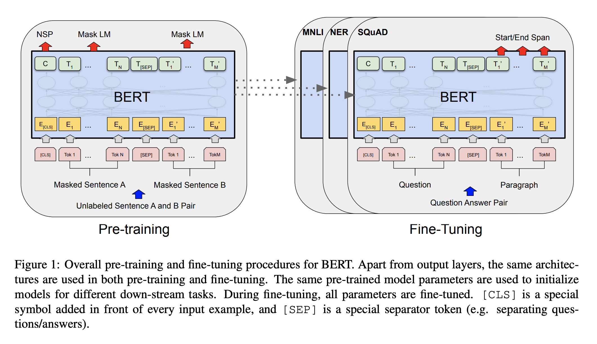
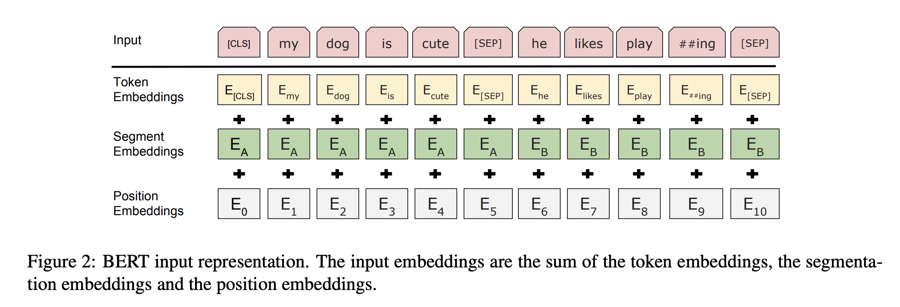

## BERT: Pre-training of Deep Bidirectional Transformers for Language Understanding

### Devlin at el, Google AI Language, 2018

Major Contribution:
* BERT is first of its kind to leverage transformer encoder architecture to train deep contexual bidirectional representations of tokens from unsupervised text corpus.
* As a result, pre-trained BERT can be fine tuned for any specific task with just one additional layer and limited labelled data.
* BERT improved GLUE benchmark by 7.7% absolute improvement, and MultiNLI by 4.6% absolute improvement and Squad 2 by 5.1% absolute improvement among others.
* Currently, GPT/ULMfit has left to right trained representation, and ELMO has shallow bidirectional representation by just concatenating left-to-right and right-to-left representation, and generally it can be leveraged as feature engineering approach for any downstream task. However BERT enable deep training of bidirectional representations and it can be fine tuned with downstream tasks.
* BERT's bidirectional encoding makes fine tuning easy and effective with reduce need of heavily-engineered features. 
* GPT and ULMfit left to right language modelling objectives were used to pretrain such models.

* Approach and Architecture:
    * Bidirectional Transformers Encoder based Architecture
    * WordPiece Embeddings for 30000 token vocabolary
    * First token of every sequence is [CLS], followed by segment 1, [SEP], segment 2, [SEP], and possible padding tokens.
    * Positional Encodings are segments encodings are added
    * Two objective functions, MLM and NSP are used for pre-training
    * Following two figures illustrate BERT architecture, how to use in pre-training and fine tuning, as well as its input representation.

    

    
    <em>Source: Author</em>
    

    

    
    <em>Source: Author</em>
    

* Ablation study shows how each key decision in BERT appraoches is adding value, and also how fine tuning is better then feature engineering.

