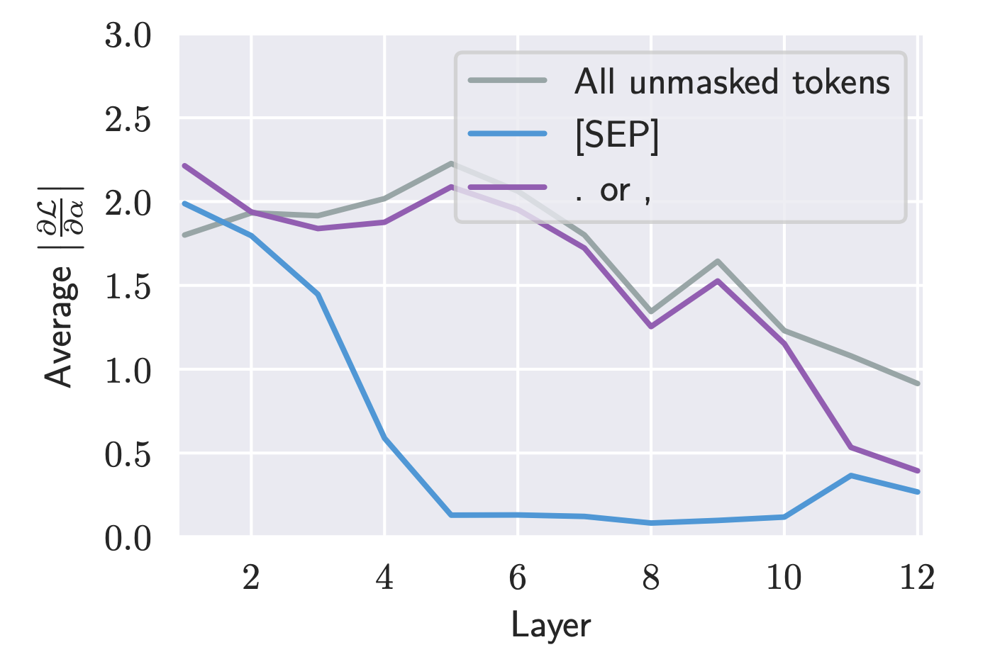
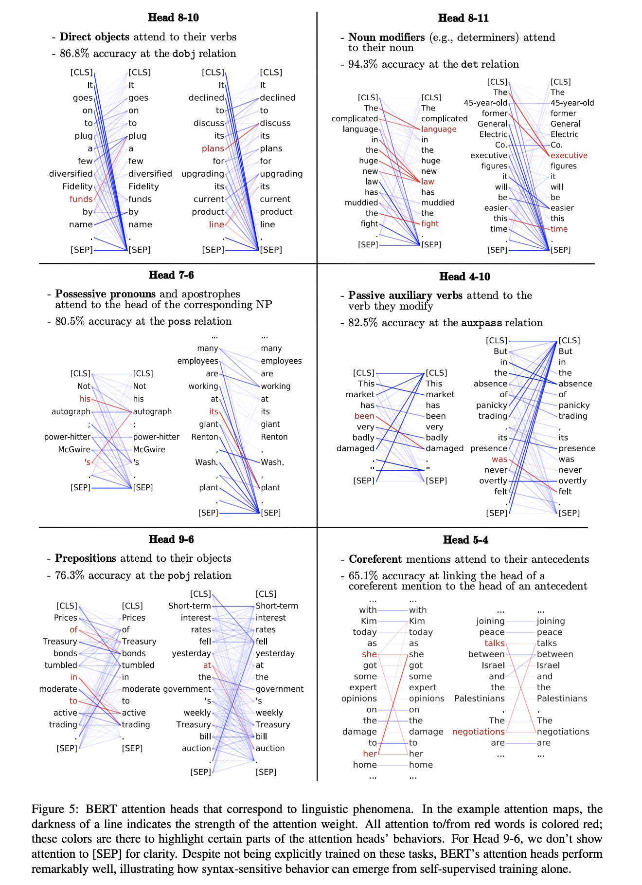
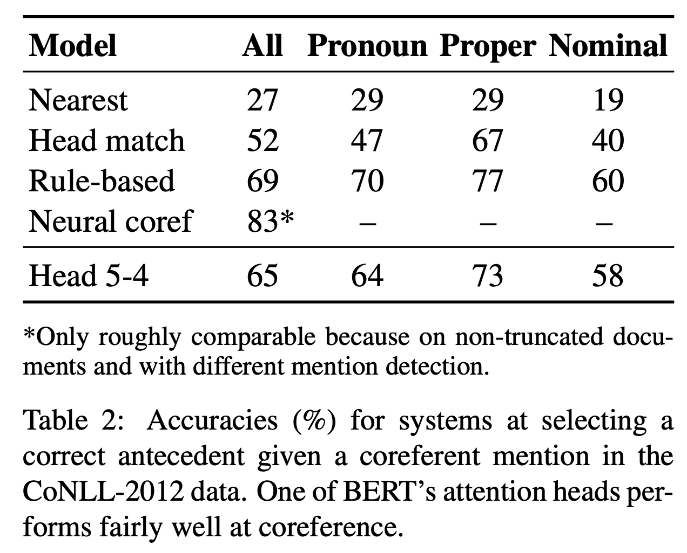
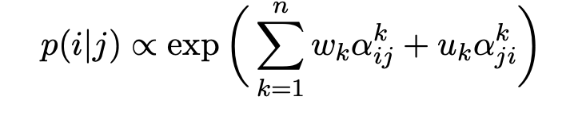
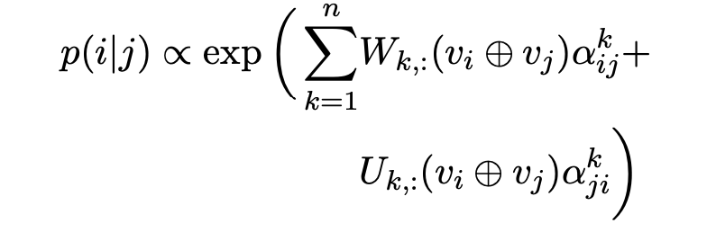

## What Does BERT Look At? An Analysis of BERT's Attention
### Kevin Clark, Urvashi Khandelwal, Omer Levy, Christopher D. Manning

Setup:
* Extract attention maps from over 1000 random wikipedia segments
* Attending to \<SEP> token:
    * It is NOT because \<SEP> token aggregate segment level information, as \<SEP> token itself should have attended broadly, but interestingly, \<SEP> token attend to itself with more than 90% of weight.
    * Diving deep, paper proves that heads with specific function attend to \<SEP> when the function is not called for on those tokens.
    

    
    <em>Source: Author</em>
    

    * Further "Gradient-based-feature-importance" etablishes that changing attention over \<SEP> token does not impact loss function much.
    

    
    <em>Source: Author</em>
    

* Probing Individual Attention Heads
    * "from" split word - average attention
    * "to" split word - sum of attention
    * Dependency Syntax:
        * Certain heads specializes in specific dependency relations. And, do achieve higher accuracy then fixed offset heuristics.
        

        
        <em>Source: Author</em>
        

    * Coreference Resolution:
        * Author proves how a specific head is doing reasonably well at coref resolution, and outperforming rule based systems. 
        

        
        <em>Source: Author</em>
        

    *  Probing classifiers for graph based dependency parsers
        * How building classifer by just using attention weights, and using attention weights + glove embeddings gives reasonable prediction of dependency parsing, and almost matching structural probe which also have used internal contextual representations. 
        * Attention only probe: w_k and u_k are learned.
            

            
            <em>Source: Author</em>
            

        * Attention + Glove weights probe: W and K are learned.
            

            
            <em>Source: Author</em>
            

        * Structural probe gives 80 UUAS score, while Attn only has given 61, and Attn + Gloves has given 71 score. 
    * Clustering Attention Heads:
        * Attention heads distance is computed based on Jensen-Shannon Divergence on attention distributions.
        * Attention heads in a layer are co-located, so their is a similarity among them. 

* Most recent work on model analysis depends on probing vector representations, or model outputs, and this paper shows intriguing results on attention maps. It should be part of toolkits for researchers to understand what nerual network learns about languages. 