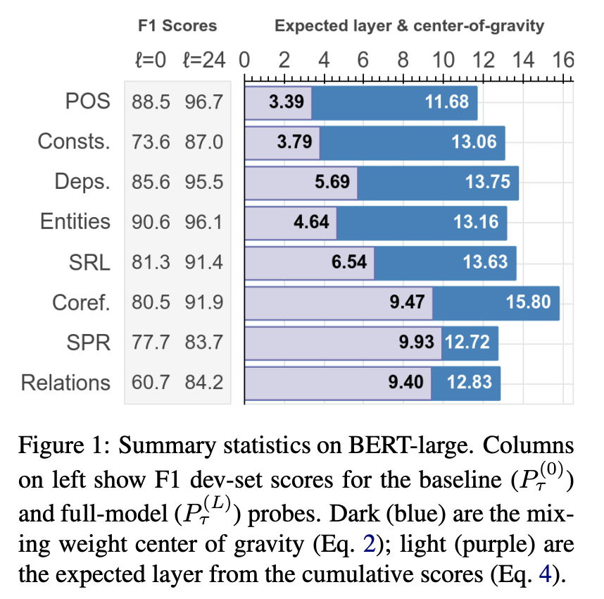
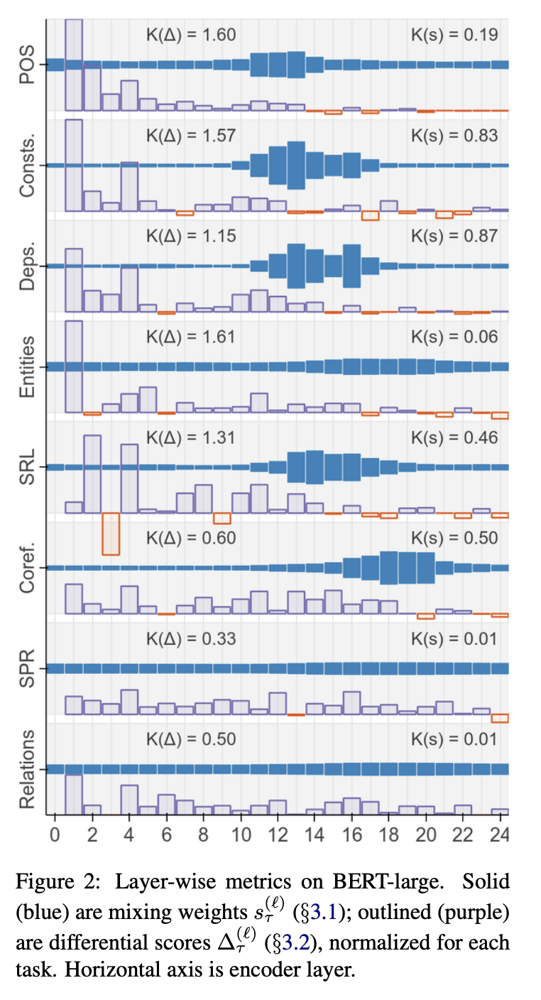

## BERT Rediscovers the Classical NLP Pipeline
### Ian Tenney, Dipanjan Das, Ellie Pavlick

Major Contributions:
* Edge Probing:
    * Probing Classifiers recieves spans s_1 = [i1, j1) and (optionally) s2 = [i2, j2), and must predict a label such as a constituent or relation type.
    * Probing classifers has access to only per token encodings with in the spans.
* Metrics:
    * Sclar Mixing Weights
        * Basically, token representation at each hiddgen layer is mixed using probability distribution derived for each task using softmax.

        

        
        

        * Where, s_τ = softmax(a_τ), and scalar parameters γτ and aτ are parameters learned while training probing classifer.
    * Center of gravity
        * For each task, center of gravity is basically expectation over layer number with its probabilities coming from softmax output.
         

        
        

    * Cumulative scoring: 
        * Series of classifiers are trained, , which use scalar mixing to layer l as well as all previous layers for task τ.
        * Differential score is computed that how much each layer adds value
        
    * Expected layer:
        * (pseudo) Expectation by taking how much relative contribution made by layer l. 
        
* Insights:
    * As we can see in the figure below, syntatics taks are solved in earlier layers of BERT, while deep semantic tasks have expected layer higher. 
    

    

    * Distribution scaling weights (softmax) and differntial weights further reinforces the value addition of each layer for various tasks.
    

                
        

    