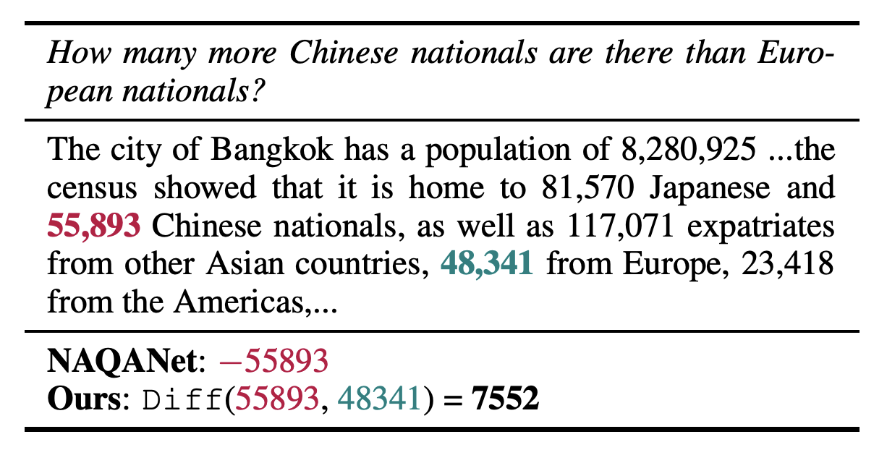
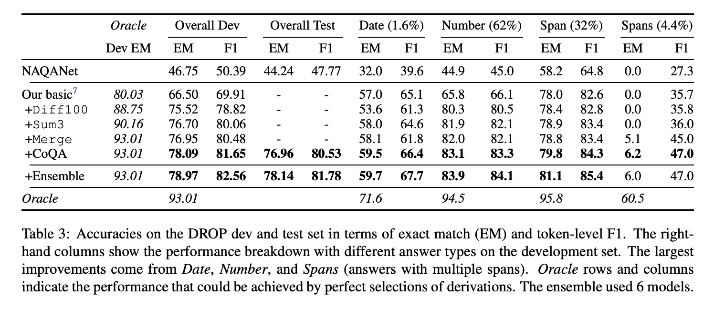

## Giving BERT a Calculator: Finding Operations and Arguments with Reading Comprehension
### Daniel Andor, Luheng He, Kenton Lee, Emily Pitler
### ACL 2019

**Whats New**
This paper augment BERT model with light weight executable programs for simple numerical operations, to perform discrete math operations over comprehension tasks. Rather than learning to manipulate numbers directly, the model pick a program to execute it.

**How It Works**
* Model is trained and validated on dataset DROP - Discrete Reasoning Over Passages. Example from DROP can be shown as below.
    

        
        <em>Source: Author</em>
        

* Model picks simple programs like Operations(args, ...)
* Where possible operations include span extraction, answering yes or no, or arithmatic.
* This model presents its effectiveness over following dimension:
    * Simple unary and binary operations
    * Compositions
    * Pre-training on CoQA and applying over DROP
    * Few-shot learning on illionis dataset (for multiplication and division)
* Model
    * BERT model is extended with light weight extraction and composition layer.
    * Model predict derivation d (progra) given Passage P and Question Q. 
    * Derivations:
        * Literals: Yes/No/0..9
        * Numerical Operations: Sum / Diff
        * Text Spans: Composition of tokens in to text-spans
        * Composition of compositions: Sum3, Merge 
    * Model Representation and Scoring:
        * Literatls: 
        * Numerical Operations: 
            * 
            * 
        * Text spans
            * 
            * 
        * Compositions of composition:
            * 
            * 
    * Training: 
        * While training, exhaustive pre-computed oracle derivations D* were used, and marginalised all d* that lead to an answer. 
        * 
    * During inference, possible space of derivation can grow quadratic with compostions, so, only top 128 span and sum results were used to compute merge and sum3. 
* Results:
    * Following figure demonstrate the impact of model, its ablation study, and over differnt types of questions, and comparision with respect to Oracle.
    

        
        <em>Source: Author</em>
        

    * Model was also easily able to learn other operations like multiplication and division on very small data Illionis math word problems dataset.

