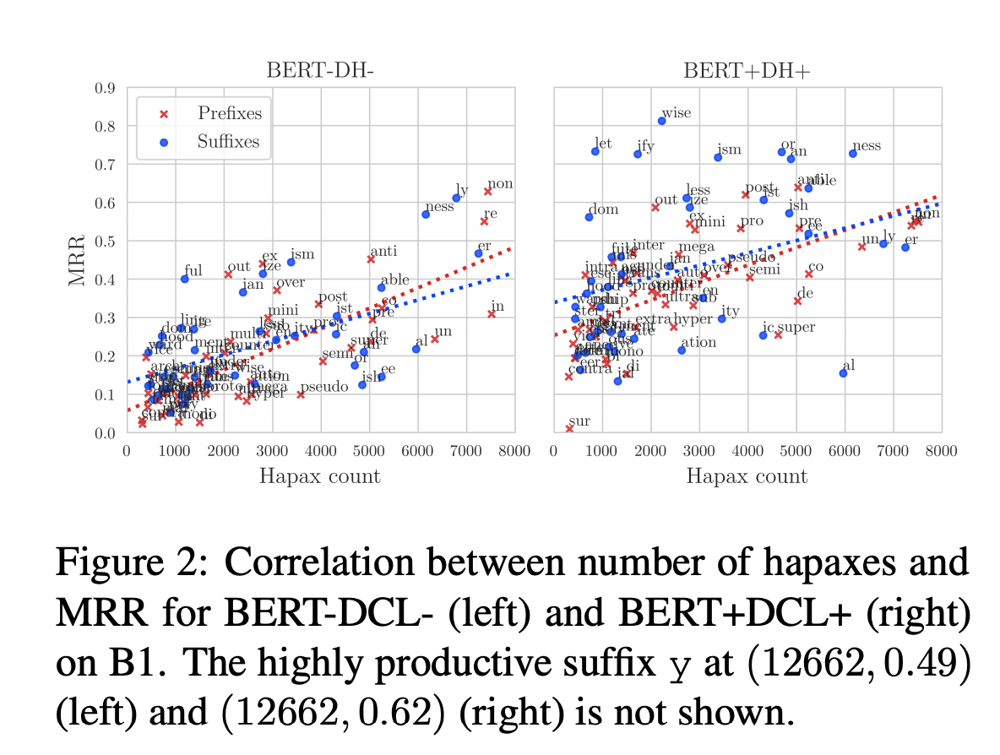

## Generating Derivational Morphology with BERT
### Valentin Hofmann, Janet B. Pierrehumbert, Hinrich Schutze 
### Faculty of Linguistics, University of Oxford
### [[arXiv](https://arxiv.org/pdf/2005.00672.pdf)]

**Whats New**

This paper studies ability of BERT to predict derivational morphology, i.e. affixes of base words using BERT + derivational classification layer.

**How It Works**

* Dataset
    * Out of 52 productive prefixes and 49 productive affixes, 48 and 44 are contained in BERT's vocab
    * Total 20259 bases were considered.
    * Extract every sentence including a word that is derivable from one of the basis using one of the prefix or suffix. 413,271 distinct derivatives in 123,809,485 context sentences

* Experiments:
    * Four Tokenization Strategies are studied
        * HYP: Inserting hyphen between prefix and word.
        * INIT: Segment prefix followed by base. Unallowed => "Un", "allowed", This looks like two words to bert.
        * TOK: Segment prefix followed by base. And, internal counter part of base is used. If internal variant is not available it is tokenised. i.e. Un, ##all, ##owed
        * PROJ: A projection matrix is learnt to project word to its internal counter part. 

            
    * Results were evaluated as MRR. Mean Reciprocal Rank. Where reciprocal rank is 1/rank, at which the expected affix is predicted.
    * Despite its simiplitciy "HYP" tokenizer does better.
    * Models having a seperate classification layer does better, then leveraging head of the pretrained model. 
    * Affixes having higher productivity can be quantified by hapaxes formed by them. Higher productive affixes got better mean-reciprocal-rank.
        

        
        <em>Source: Author</em>
        
 

**Key Insights**
* BERT’s WordPiece tokenizations are often morphologically incorrect
* An experiment was designed, a binary classifer model, to predict if "unwearable" is possible derivative for contxt "This jacket is .......". 
* the morphologically correct segmentation (MP) or BERT’s WordPiece tokenization (WP) were compared
* MP segmentation has given better performance.

