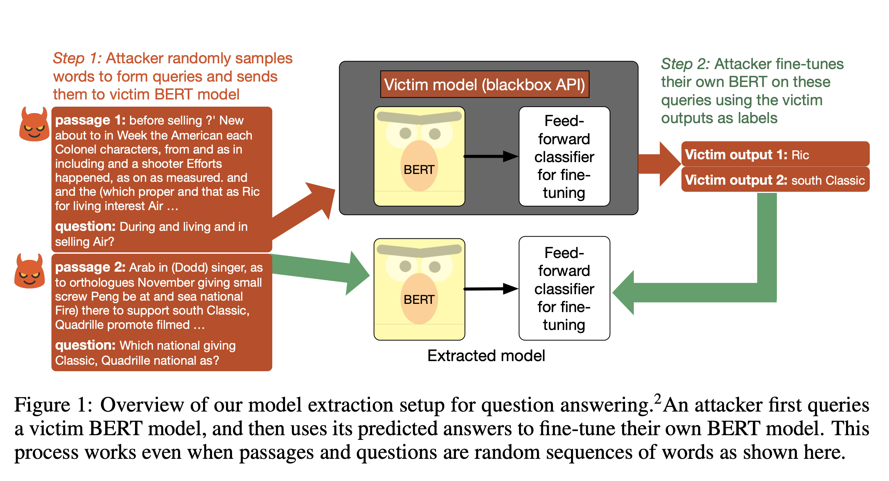

## THIEVES ON SESAME STREET! MODEL EXTRACTION OF BERT-BASED APIS
### Kalpesh Krishna, Gaurav Singh Tomar, Ankur P. Parikh, Nicolas Papernot, Mohit Iyyer
### ICLR 2020

**Whats New**
This paper present a possible threat to extract or steal a model deployed in a public setting, it demonstrate how good an attacker model can perform under different settings, and also proposes two defence strategies to prevent or detect such vulnerability.

**Key Insights**
* Yes, it is possible to extract model even without having access to sensiscal queries.
* It proposes and examine two heurist methods to analyse how attacker model can steal victim model's learning.
* If a victim model is fine tuned on pretrained model, it becomes easier to extract.
* Architecture of attacker model and victim model need not to be the same, bigger attacker model have better learning potential.
* Output produced by victim model on non-sensical queries does not resonate well with human annotators.

**How it Works**
* Query data are prepared with following two heuristics
    * RANDOM: an input query is a nonsensical sequence of words constructed by sampling a Wikipedi vocabulary built from WikiText-103
    * WIKI: input queries are formed from actual sentences or paragraphs from the WikiText-103 corpus
* Further following task specific heuristics are applied:
    * MNLI: Randomly replace three words in premise with hypothesis
    * SQuAD / BoolQ: Uniformly sample words from question to form a question.  And, with prefix like What, etc, and question symbol at the end.
* Following figure illustrates the approach:
    

    
    <em>Source: Author</em>
    

**Results**
* Attacker could learn victim's knowledge with just a little drop in accuracy i.e. 2%-6% depending on the complexity of the task.
* More query budget gives better performance to attacker model, even thought queries are non-sensical.
* If there are multiple victim models, then selecting query which has better aggrement between victim models, gives better performance to attacker model.
* Even though, victim model was bert-base, attacker with bert-large gets better performance. and, XL-net even better performance.

**Defences**
* Outlier detection, and returnig no-result on those queries by Victim.
* Let say, it was very difficult to extract model trained on squad 2, as it has an option of returning no_answer.
* Watermarking - tiny fractions of queries are chosen at the runtime and modified to return a wrong output.