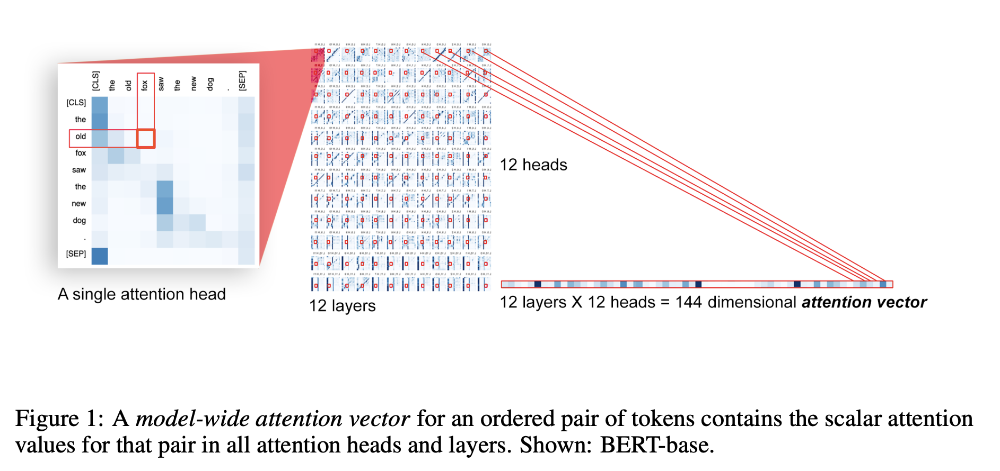
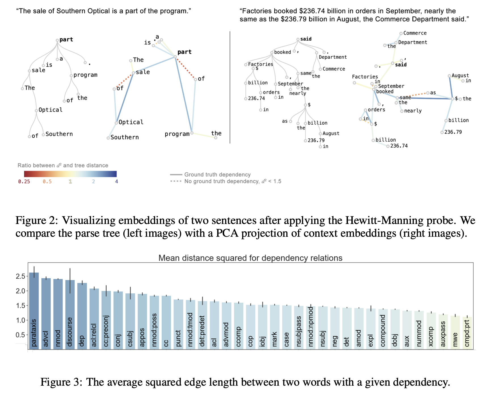
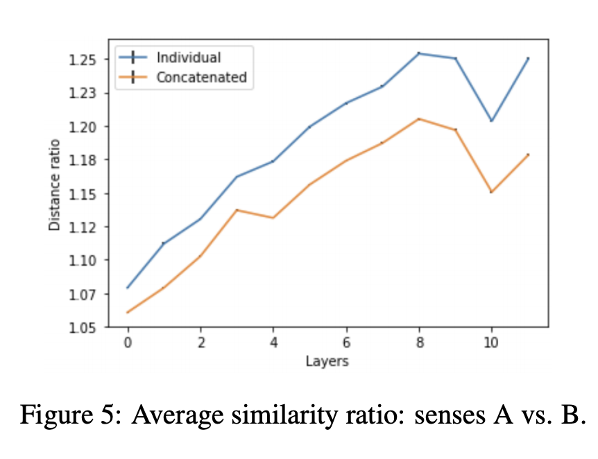

## Visualizing and Measuring the Geometry of BERT
### Andy Coenen, Emily Reif, Ann Yuan, Been Kim, Adam Pearce, Fernanda Viégas, Martin Wattenberg
### NIPS 2019, [[arXiv](https://arxiv.org/pdf/1906.02715.pdf)]

**Whats New** This paper extend the analysis by Hewitt and Manning on what syntactic knolwedge is endcoded by BERT attentions, and embeddings. It also give mathamatical intution and other similar experiemnets

**Experiment 1: Attention Probes and Dependency Representations**
* Flattened attention vector, and binary classifier to predict if a dependency relation exists, and if it does, then a multi-class classifier to predict the class of dependency relation.
    

        
        <em>Source: Author</em>
        

* Results, accuracy of 85.8 for binary classifier and 71.9% for multi class probe.

**Experiment 2: Geometry of Parse Tree Embeddings**
* Context: Hewitt proposed that parse tree distance seem to correspond specifically to square of ecludian distance. 
* Mathematical proof that squared ecludian distance, or pythagorian embedding proves that tree with n nodes has a pythagorean embedding in space of R^n-1, where,
    * node of tree, t0,...t_n-1
    * t0 being root node, origin
    * t1,..,t_n-1 denoted by embedding e_1,..,e_n-1 are orthogonal vectors, 
    * If x and y are m tree distance away, their pythogorian embedding distance would prove that they are m distance away.

* For each word in an input sentence, token embeddings at 16th layer were extracted
* They were transformed by Hewitt Manning's "Structural Probe" yieling dimensions 1024
* PCA was applied to reduce dimensions to 2.
* Words are plotted, if the distance was correlated with actual tree distances.
* For each dependency relation type, how it impacts the distance was also derived.
    

        
        <em>Source: Author</em>
        

**Experiment 3: Geometry of Word Senses**
* Visualizing word senses demonstrated how BERT represnets them internally. 
    * for a word, 1000 sentences were fetched, and their token embeddings was represented.
    * Figure shows the clustering of word senses
    

        
        <em>Source: Author</em>
        

**Experiment 4: Word Sense Disambiguation Capability**
* For a given word with n senese, a nearest neighbour classifer where each neighbour is the centroid of a word's sense's BERT base embeddings in traiing data.
* Simple nearest neighbour classifer gives 71.1 F1 score.
* Experiment 4b:
    * Hypothesis: An embedding subspace for word senses may exist with a simple linear transformation.
    * A matrix B \in R^(k x m) was initialised, and a loss function to maximise clustering, i.e. inter cluster difference by intra cluster distance. 
    * 71.5 F1 score was achieved. (modest improvement in accuracy, but performance was dramatically imprpved in the intial layers) 

**Experiment 5: Embedding Distance - Concatenate experiment**
* 25,096 sentence pairs from SemCorr, using the same word with differnt senses are extracted.
* Matching and Opposing sense centroid for each keyword is defined.
* Individual Similarity Ratio = cosine simialarity with matching words / cosine similarity with opposing words
* Individual Similarity Ratio would be greater then 1.
* Now these senteces are concatednated, hence the context should get mix, and the ratio is computed as "concatenated similarity ratio". 
* Concatenated similarity ratio should be lesser than individual similarity ratio to validate the impact of context on word sense.
    

        
        <em>Source: Author</em>
        

