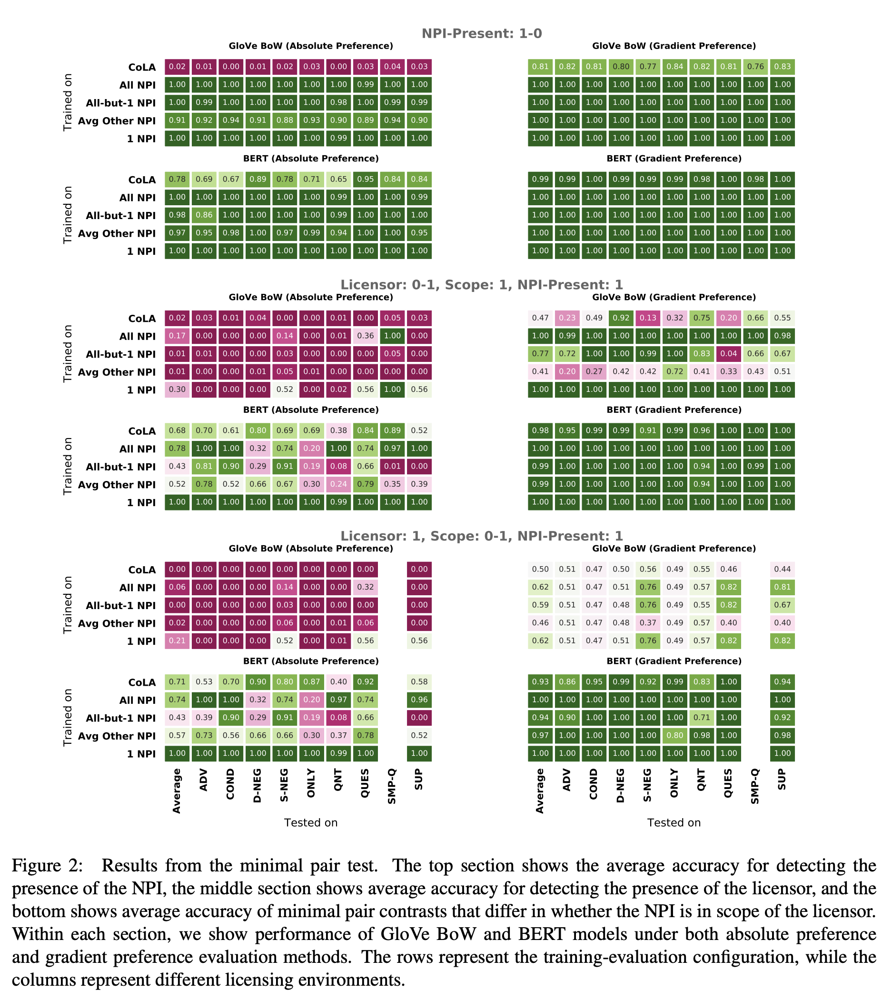

## Investigating BERT’s Knowledge of Language: Five Analysis Methods with NPIs [[arXiv](https://arxiv.org/pdf/1909.02597.pdf)]
### Warstadt et al. 
### ACL, 2019

**Whats New** Authors have defined five experiments for NPI - Negative Polarity Items and generated data for those experiments. And, BERT model was tested agains baseline GLOVE data that how well it learns syntactic and gramatical knowledge.

**How it works**
* Three rules around negative polarity item, NPIs were framed. 1) Presence of NPI, 2) Presence of Lincensor, 3) NPI is in the scope of licensor

* Examples of such cases are as below

<em>Source: Author</em>

* Five pairs of data was generated, where they differen either in presence of licensor, NPI or scope.

* Five different test environment were framed:
    * Trained on CoLA
    * 1 NPI: training and evaluating on same NPI
    * Avg Other NPI: training independently on every NPI except 1, and average over all evaluations on that enviornment
    * All-but-1 NPI: training on all environment and evaluating on that enviornment
    * ALL NPI: training on all environments

* For each of the above enviroments, following test were applied
    * Acceptability Judgement
    * Absolute and Gradient Minimal Pairs: Minimal pairs differ only by presence of 1 word. and Gradient measure involves if model assign higher probability to accepted sequence.
    * Cloze Test
    * Feature Probing: i.e. whether NPI is in the scope of licensor or not.

* Minimal pairs results under three different cases for "Absolute and Gradient minimal pairs" are as below:

<em>Source: Author</em>

