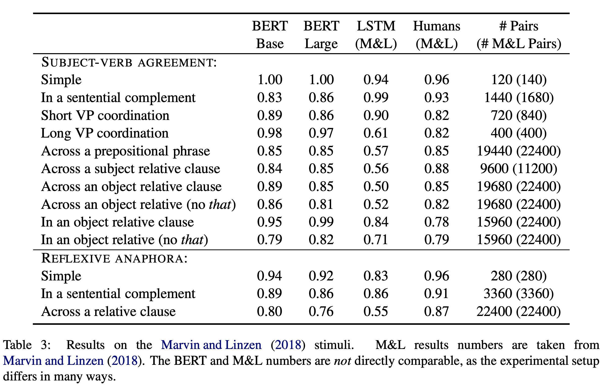

## Assessing BERT’s Syntactic Abilities
### Yoav Goldberg
### 2019, [[arXiv](https://arxiv.org/pdf/1901.05287.pdf)]

**Whats New**
This paper analyze syntactic ability of BERT using subject verb agreement stimuli.

**How It Works**
* Colorless Green Ideas: content words in naturally occurring sentences are replaced with random words with the same partof-speech and inflection, thus ensuring a focus on syntax rather than on selectional-preferences based cues.
* Previous Setups:
    * Linzel et al (2016):
        * Feed each sentence from wikipedia, and stop at focus word
        * Ask model to predict binary plural/singular decision
        * Evaluation is performed in sentences with agreement attractors, i.e. atleast one noun between the verb and its subject. and all the nouns between the verb and its subject are of opposite numbers.
    * Gulordava et al (2018):
        * In order to control "semantic selectional-preference", they replace each word with random words from same part of speech and inflection. 
        * Prediction is correct if the higher probability is assigned to the correct inflection of the original verb is higher than to incorrect inflection.
    * Marvin and Lizen (2018)
        * Feed grammatical and ungrammatical sentences to the model
        * Compare the perplexity assigned by the model
        * Prediction is considered correct if the probability assigned is higher for gramatical one than ungramatical one.
* Adaptation to the BERT model
    * Masking out just the focus word
    * Discard sentences if
        * minimal pair differs in two words position
        * agreement cases involving is/are (some of them are copular construction, and strong aggrement hints can be found also on object following verb)
        * discard sentence in which the focus verb or its singular/plural inflection does not appear as a single word in wordpiece vocabolary.
    * Results are not directly comparable, but BERT has shown very strong agreement.
    * Also, bert-base does better than even bert-large. So, large is better is not true for syntactic abilities.
        

        
        <em>Source: Author</em>
        
