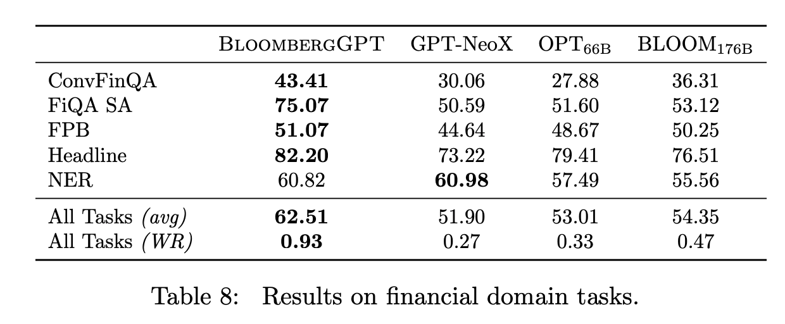
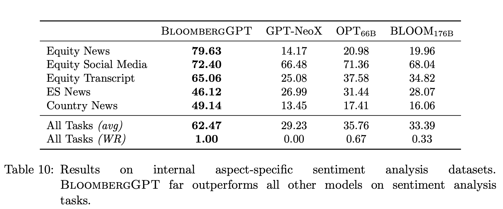

## Bloomberggpt: A large language model for finance.
### Wu, Shijie, et al.
### arXiv preprint arXiv:2303.17564 (2023) [[PDF](https://arxiv.org/pdf/2303.17564.pdf)].

**Key Points**

* BloombergGPT is a LLM for Finance. It is 50b parameters models trained on 700B tokens, where 50% of data are finance data.
* It was trained on 64 p4d.24xlarge for 53 days, which makes it training cost around USD 2.67M.
* Model and data has not been released publicaly, citing concerns about leakage of finance filing data.
* FINPILE data are internal to Bloomberg, which is responsible for 51.27% of total data, which is broken down as 42% from web, 5% from news, 2% from filings, 1.21% for Press and 0.7% from Bloomberg.
* It uses unigram tokenizer, 2^17 tokens. It does not use subword tokenizer. It allocates 32 bytes for other extra tokens instead of OOD token. 
* It concatanate multiple records in a chunk size of 2048 tokens using <|endoftext|> tokens to delimit those multiple records.
* Model size (parameters) was selected based on the compute budget availbale from Hoffmann's scaling laws. 
* It leverages Laerge-scale optimization techniques like ZeRO optimziation (shards the training table across tge group of GPUs), MiCS (decreases training communication overhead using hierarchical communication, 2-hop gradient update, scale-aware model partitioning)
* It outperfoms other models similar to its size, and Bloom 176B parameters on finace domain tasks like QA, NER, sentiment analysis, aspect sentiment analysis, etc. 

  

        
        <em>Source: Author</em>
        

 

        
        <em>Source: Author</em>
        
