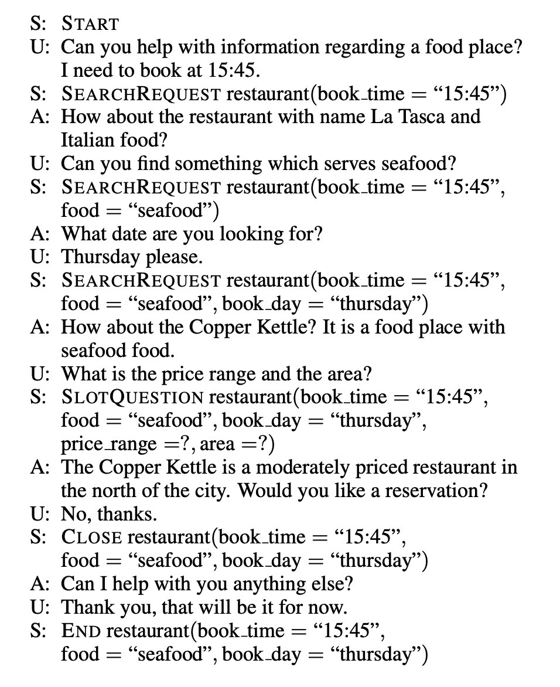
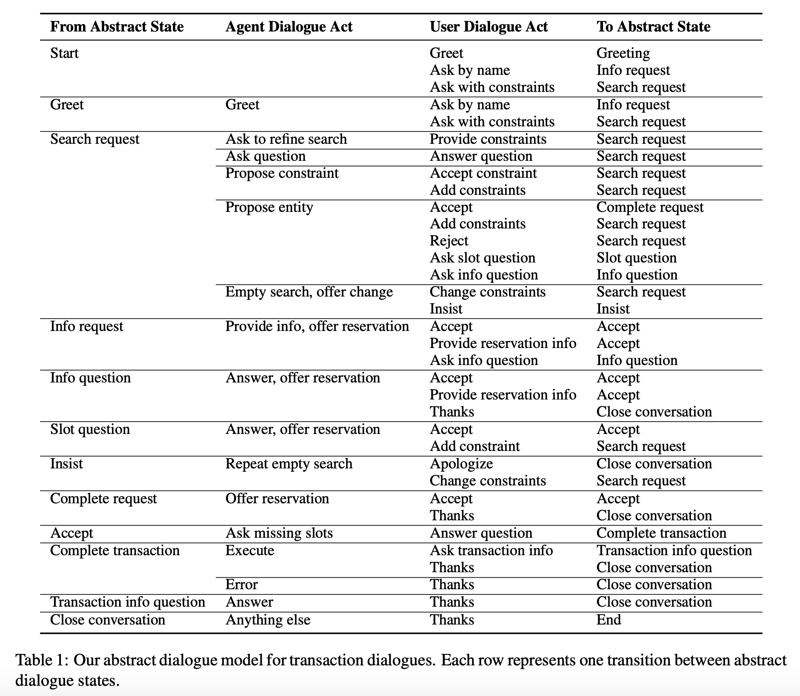
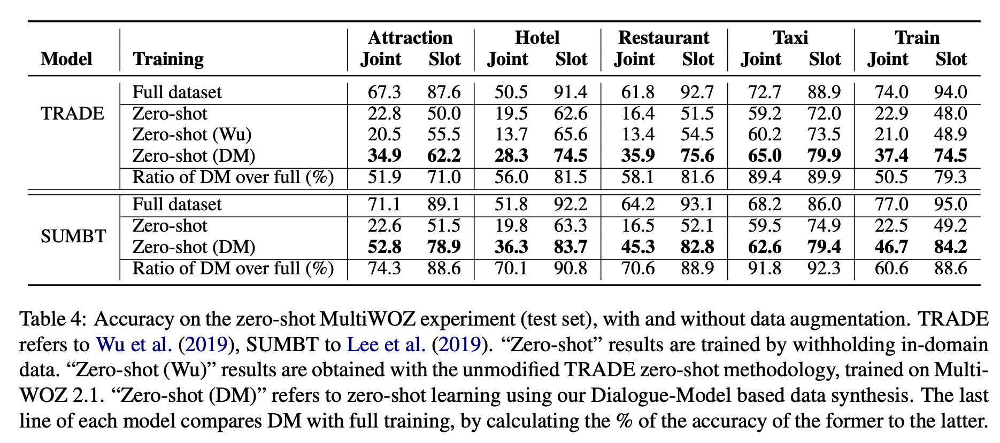
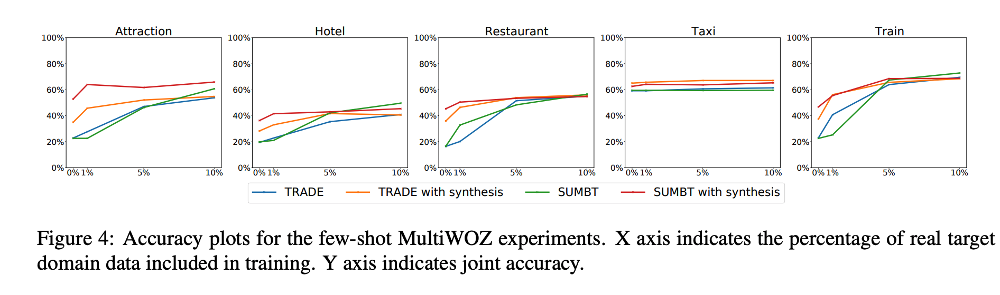

## Zero-Shot Transfer Learning with Synthesized Data for Multi-Domain Dialogue State Tracking
### Giovanni Campagna Agata Foryciarz Mehrad Moradshahi Monica S. Lam,
### ACL 2020 [[arXiv](https://www.aclweb.org/anthology/2020.acl-main.12.pdf)]

**Whats New**
This paper presents a study that synthetic data for new domains in a multi domain chat bots can improve performance of new domain without availability of the tagged data.

**How it Works**
* It maintains a state with each dialogue in the queue, where additional constraints are defined or introduced.

    
    <em>Source: Author</em>
    

* State transition model based on user and agent interactions are defined, can be seen as follow:

    
    <em>Source: Author</em>
    

**Results**
* A particular domain data was removed, and synthetic data was added. And performance with zero-shot learning was measured and its as below.

    
    <em>Source: Author</em>
    

* Synthetic data are also helpful in few-shot learning setup. Its impact can be seen as below:

    
    <em>Source: Author</em>
    
