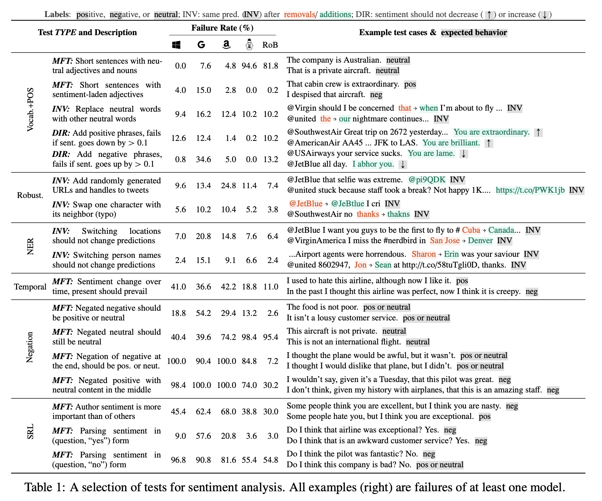
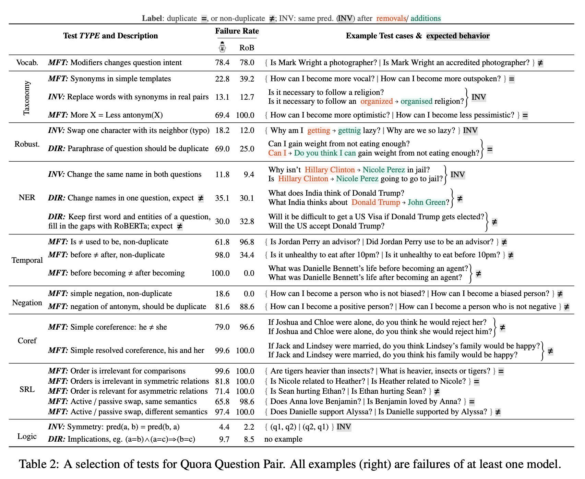
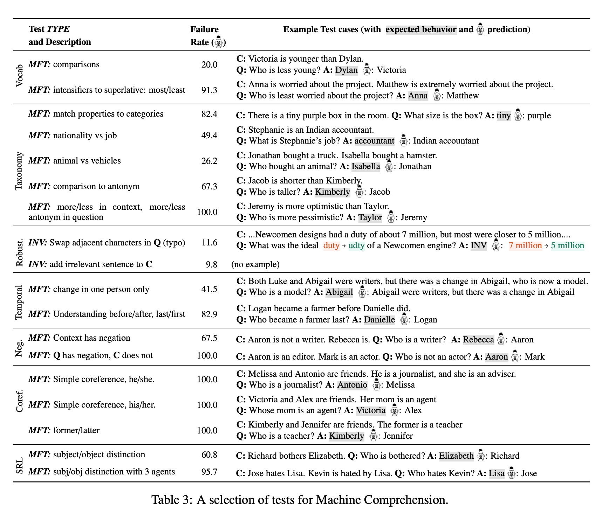

## Beyond Accuracy: Behavioral Testing of NLP Models with CheckList
### Marco Tulio Ribeiro, Tongshuang Wu, Carlos Guestrin, Sameer Singh
### 2020, Microsoft Research, ACL 2020

**What's new**
This paper present a simple and structured framework towards meaningful testing of NLP models. 

**Key Insight**
It is interesting to discover, how hold-out set accuracy is a poor metric to represents the skills mastered by model. Models surpassing human baselines are indeed failings at numerous simple and obvious test cases generated by CheckList, which reveals that do NLP models truely expertise linguistics?

**How it works**
* This paper layout a basic framework by taking three NLP tasks as reference, Sentiment, QQP, and Comprehension
* CheckList is table, where, 
    * Row stands for capability to be tested
    * Columns stands for test types
        * MFT is minimal functional test, where expected label is given with the test case
        * INV / Invariance test, where perturbed test example should not change the orinal label
        * DIR / Directional, where pertubrations are directional in nature, monotonically decreasing sentiments
* Following figures gives complete idea on what are different capabilities and test types can be thougth of to begin with.

    

    
    <em>Source: Author</em>
    

    

    
    <em>Source: Author</em>
    

    

    
    <em>Source: Author</em>
    

* Few interesting templates
    * {P1} is not a {PROF}, {P2} is. eg: “John is not a doctor, Mary is.”; “Who is a doctor?”, BERT model fails 89.1% of time. If, PROF is secretary, then it wrongly picks man only 4%, and woman 60.5% of time.
    * All commercial sentiment analysis system fails when negation is at the end: (e.g I thought the plane would be awful, but it wasn’t.)
    * BERT failed 100% on cases where more/ less was flipped and antonym was used i.e. *more optimistic* replaced by *less pessimistic.*

**Take Away** Checklist not only gives a way for evaluting NLP system but also can inspire data augmentation techniques to train NLP models with better performance.
    

