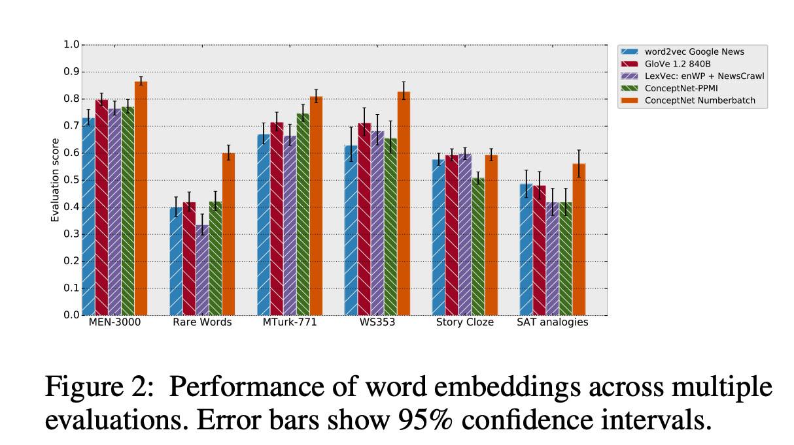

## ConceptNet 5.5: An Open Multilingual Graph of General Knowledge
### Robyn Speer, Joshua Chin, Catherine Havasi
### AAAI 2018

**Whats New**
ConceptNet is one of the largest knowledge graph that connects words or phrases of natural langauges with labelled edges. This paper also shows potential of using KG with word embeddings derived from distributional semantics on NLP tasks like relatedness, analogies, cloze tests etc.

**ConceptNet: Introduction**
* It has over 21 millions edges connecting 8 millions of nodes. Its english vocabolary is around 1.5 millions of nodes.
* Wiktionary is the largest source of edges, contributing over 18 millions edges.
* **Core symmetric relations** are: Antonym, DistinctFrom, EtymologicallyRelatedTo, LocatedNear, RelatedTo, SimilarTo, and Synonym
* **Core asymmetric relations** are: AtLocation, CapableOf, Causes, CausesDesire, CreatedBy, DefinedAs, DerivedFrom, Desires, Entails, ExternalURL, FormOf, HasA, HasContext, HasFirstSubevent, HasLastSubevent, HasPrerequisite, HasProperty, InstanceOf, IsA, MadeOf, MannerOf, MotivatedByGoal, ObstructedBy, PartOf, ReceivesAction, SenseOf, SymbolOf, and UsedFor

**ConceptNet based Embeddings**
* ConceptNet PPMI Embeddings
    * Sparse matrix with the concepts having atleast three connections
    * Compute PPMI for each pair of concepts
    * SVD - truncate it to 300 dimensions
    * Pruned away concepts, take average of its neigbours
* Combining ConceptNet with Distributional Word Embeddings
    * Retrofitting - its a process of adjusting exsiting matrix of word embeddings using a knowledge graph.

        

    * Where q_i_hat is orignal embeddings, and q_i are new ones. q_i and q_j pairs are from ConceptNet.
    * "ConceptNet Numberbatch" was derived by applying above method on multiple soruces. 
        * Common vocabolary was created, and their embeddings were concatenated
        * Concatenated embeddings were porjected to 300 dimensions using SVD
        * Each soruce specific remaining vocabolary was introduced and it was projected to SVD projected 300 dimensions derived for common vocab.
        * ConceptNet pruned away nodes were introduced by taking average of their neighbours

**Results**
* ConceptNet Numberbatch has outperformed other embedding techiques on tasks for word relatedness, SAT-analogies, and Cloze-test
    

        
        <em>Source: Author</em>
        

