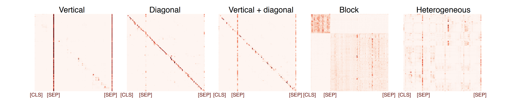
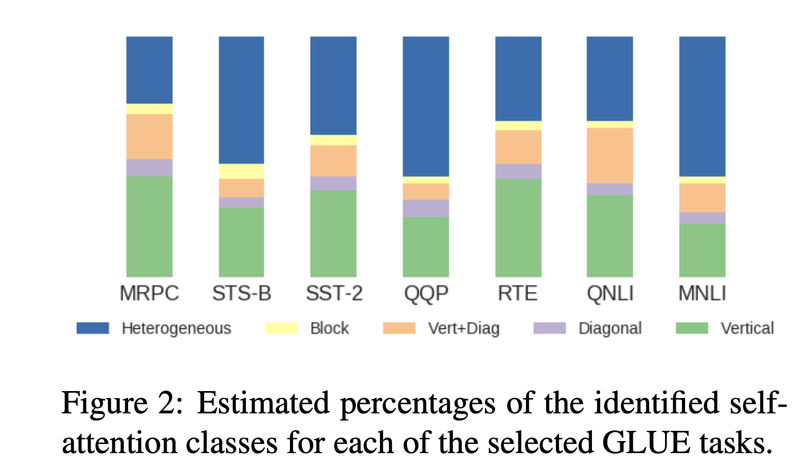
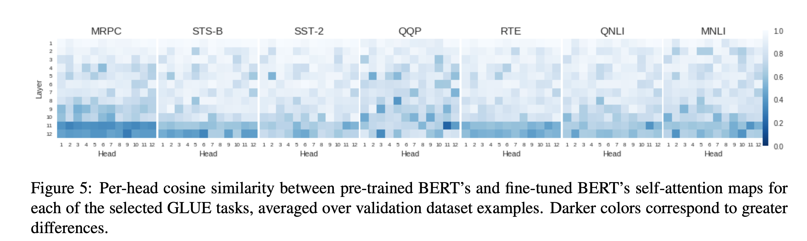

## Revealing the Dark Secrets of BERT
### Olga Kovaleva, Alexey Romanov, Anna Rogers, Anna Rumshisky
### ACL 2019

**Whats New** This paper analyses self attention patterns from different perspective, and mainly found there are 5 different types of patterns, and disbaling few heads can also improve perforamnce

**Hypothesis & Experiments**
1. Self attentions maps was classified in one among, Vertical, Diagonal, Vertical+Diagonal, Block and Hetrogeneous. And, authors found similar patterns in task specific fine tuned model.

    

        
        <em>Source: Author</em>
        

    

        
        <em>Source: Author</em>
        

    
2. Relation specific heads
    * Authors have used FrameNet dataset, which has annotations of semantic relation between different words/phrases of sentences. 
    * Took subset of framenet dataset, where for each lexical unit, like "commercial_transaction", or "scrutiny" etc, shorter sentences with frame elements of 3 tokens or less were identified. 
    * BERT attention for each head was max attention for the token pairs for the expected annotations based on framenet was averaged across all examples, and heads were ordered. 
    * Top 2 heads appeared to capture this relations really well. considered as an evidence that certain types of lingusitcs relations may be captured by specific heads based on its attention maps.

3. Change in self attention pattern after fine tuning
    * self attention at each head was flattened, and it was compared after fine tuning using cosine similarity. 
    * Top layers differs a lot, while bottom layers stays similar. 

    

        
        <em>Source: Author</em>
        

4. Which heads attends to SEP and CLS tokens
    * It appears that top layers attends more to CLS tokens, while bottom layers attend to SEP tokens.

5. Top layer: what token types are attended by CLS
    * For few tasks, there was not evident pattern, and CLS attened SEP tokens. But for other few, like STSB, QNLI, it was seen that CLS token attend Noun tokens more.

6. Disabling Self Attention Head
    * Attention was divided equally among token to cosider it disabled.
    * Few attention heads have improved performance when it was disabled. 

**Reflection** Mainly few experiments were conducted, but this paper does not give concrete reusable hypothesis. And also, "What does bert look at" has done really good analysis on what does it mean to attend [SEP] or [CLS] token, so that kind of interpretation, a better analysis could have been done. 