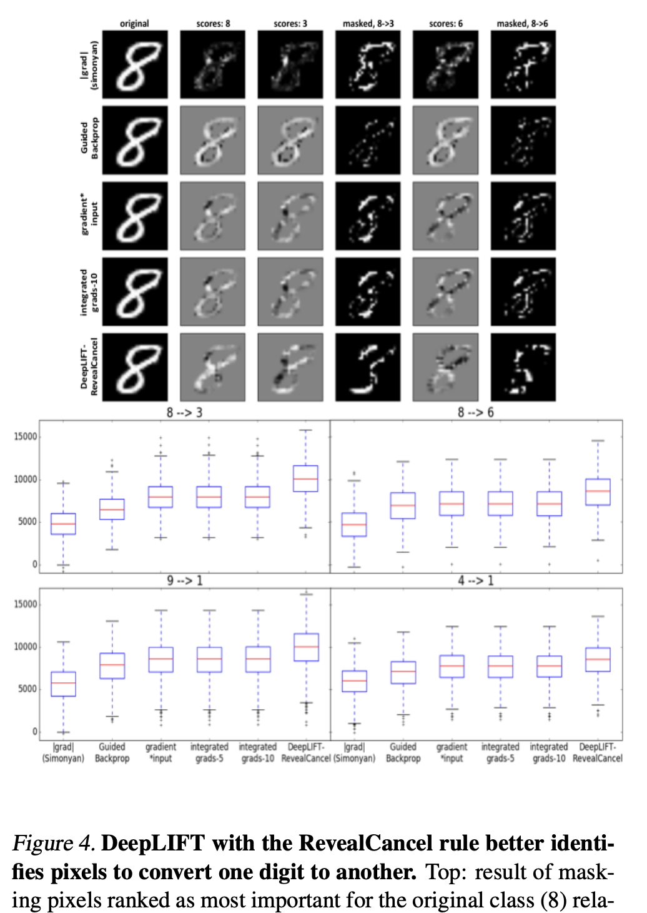

## Learning Important Features Through Propagating Activation Differences
### Avanti Shrikumar, Peyton Greenside, Anshul Kundaje
### Stanford University
### ICML 2019

**Whats New** DeepLift is a method for decomposing the output prediction of neural network on a specific inputs by back propagating the contributions through all intermediate neurons. 

**Major Contribution**
It has two unique contributions:
* "difference-from-reference" method allows DeepLift to handle zero gradients as well as discontineous gradients unlike others.
* Seperate positive and negative contributions would reveal dependencies missed by other approaches. 

**How It Works**
* Formally, let  **t**  represent target output.
* let **x1,x2,..,xn** represent some neurons/set of layers or inputs which are necessary and sufficient to compute **t**.
* **\delta t = t - t_0** is change in output with respect to reference output
* **\delta x_i = x_i - x_i_0** is change in i_th x component. 
* DeepLIFT assigns contribution scores **C_delta_x_delta_t** to **delta_x** as follow "**summation-to-delta**" property

    

    * **C_delta_x_delta_t** can be positive even if partial derivative of dt/dx is zero, so it solves the problem of saturation.

* Definition of multipliers: This is analogus to partial derivative.

    

* **The chain rule of multipliers** is analogus to chain rule of partial derivatives.

    

* **Seperating Positive and Negative Contirbutions**
    * Another consistency can be achieved if positive and negative contributions are seperated. i.e. shapely approximations can be applied.

        

* **Linear Rule** 
    * This applies to dense and convolution layers. When y is a lienar function of x_i. 

         

        

* **Rescale Rule**
    * This rule applies to nonlinear transformations that take single input, such as Relu or Sigmoid.

        

* **RevealCancel Rule: Shapely Approximation**
    * Positive outcomes are computed from adding positive contributions in reference inputs, and reference inputs with negative contributions. Similerly for Negative outcomes.

       

    * This rule helps alleviating issue which arise from positive terms cancelling negative terms and vice versa.

* Target layer
    * Pre-softmax layer is taken as a target layer. Where, contributions are normalised.

**Results**
* MNIST: to change original class to target class, pixel importance are computed, and pixels are ranked in the order of their importance, and top 20% pixels are masked. The change in log odds of original vs target class is computed. It is found that DeepLift does much better than gradients, gradients*input, integrated gradient.

    

        
        <em>Source: Author</em>
        

    

