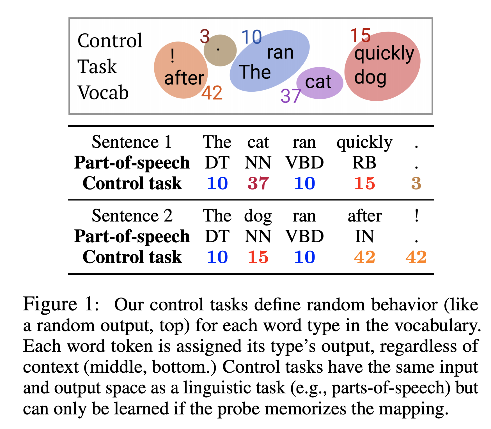
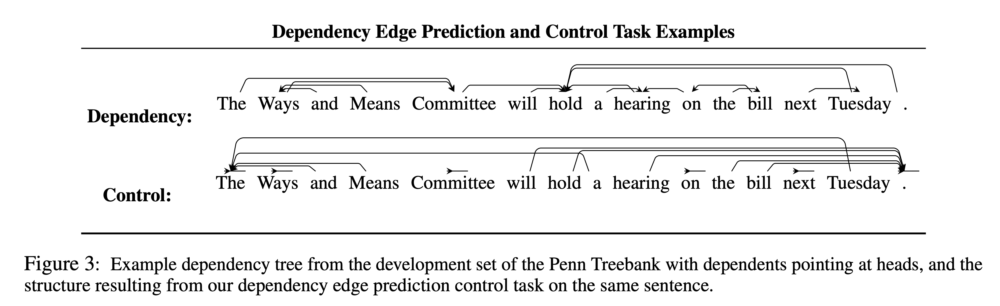
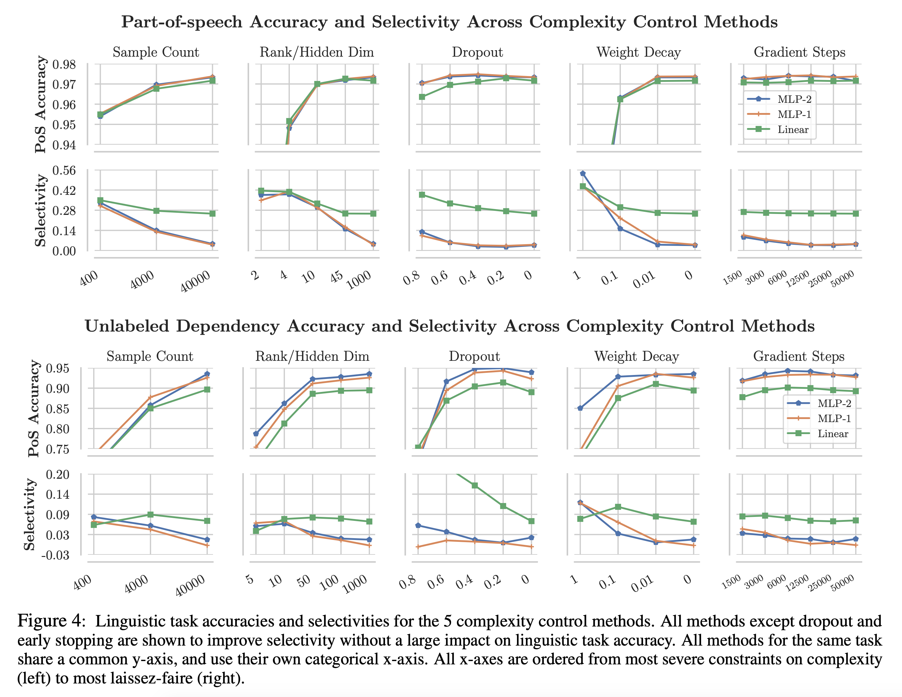

## Designing and Interpreting Probes with Control Tasks
### John Hewitt,  Percy Liang
### Stanford University, 
### EMNLP 2019

**Whats new** This paper suggests guiding principle of designing and interpreting probes, that how can we conclude linguistic knowledge is captured in representation, or is it probes ability to memorise or learn? Concept of "selectivity" is introduced, which is the difference in accuracy of a random control task sharing the same output space as probe task.

**How it works**
* This paper gives guidelines of validating how far linguistic knowledege is captured.
* Current state of research generally validate that with baseline of random representations 
* One weakness is that, what if representations are lossless, and probe is able to memorise it? 
* Authors stress on importance of designing a control task with some random function sharing the output space of the same task. measure **selectivity** which is difference in accuracy between liguistic task and control task. Higher selectivity leads to better validation of liguistic knowledge.
* Experiments for parts-of-speech and dependency-tree are conducted. 

**Key finindgs**
* MLP probes achive low selectivity with popular hyper parameters settings.
* Linear and bilinear probes achieve relatively higher selectivity.  
* Most popular method for controlling probe, dropout, complexity does not lead to selective MLP probes. However control of MLP complexity does (small hidden states, traning sample sizes) leads to higher selectivity.
* Layer 2 of ELMO gives much higher selectivty of around 31.4 with linguistic accuracy of 96.6.  

**Key Figures**

* Random control taks for POS Tagging

    

    
    <em>Source: Author</em>
    

    * Random control task for dependency head prediction

    

    
    <em>Source: Author</em>
    

    * Accuracy vs Selectivity with different experiments

    

    
    <em>Source: Author</em>
    
