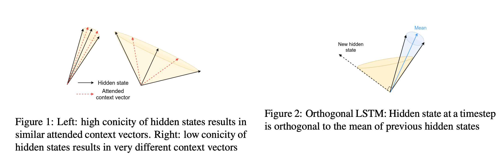
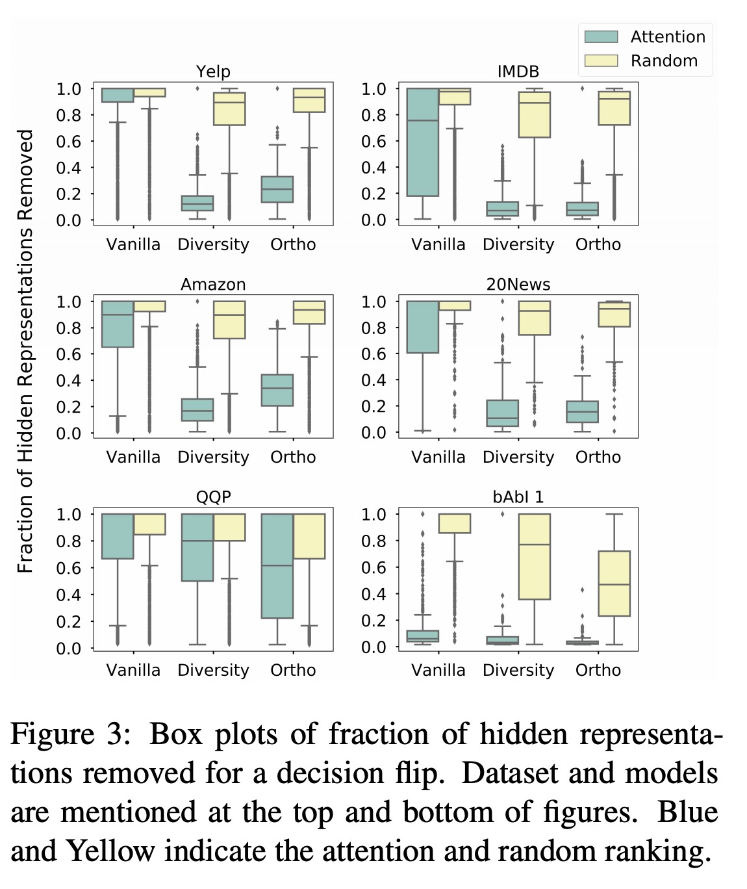
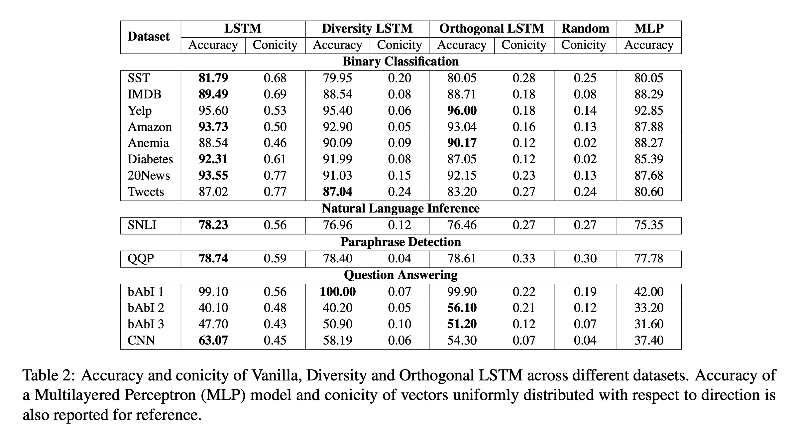
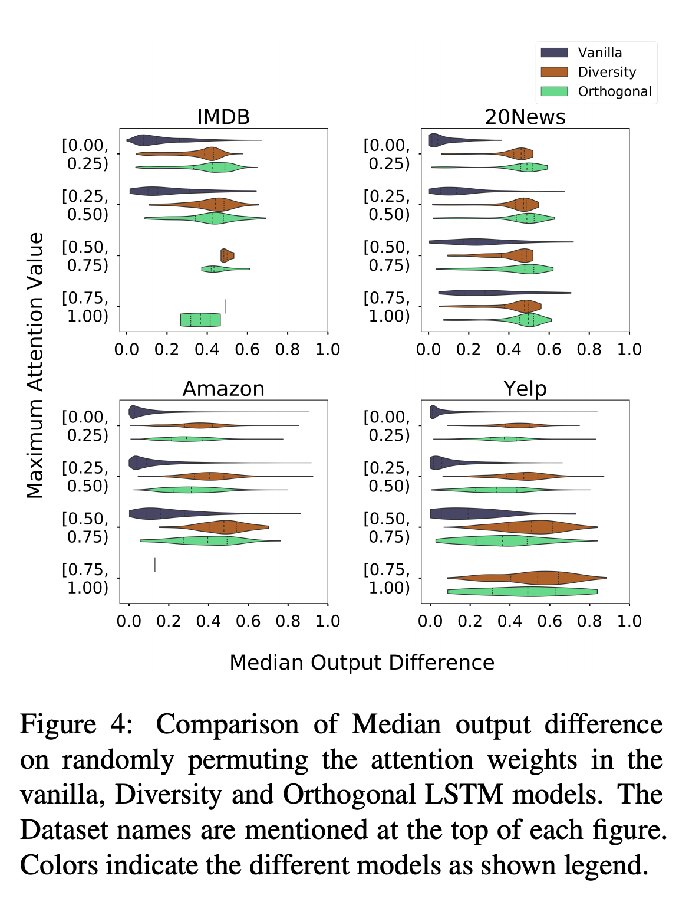
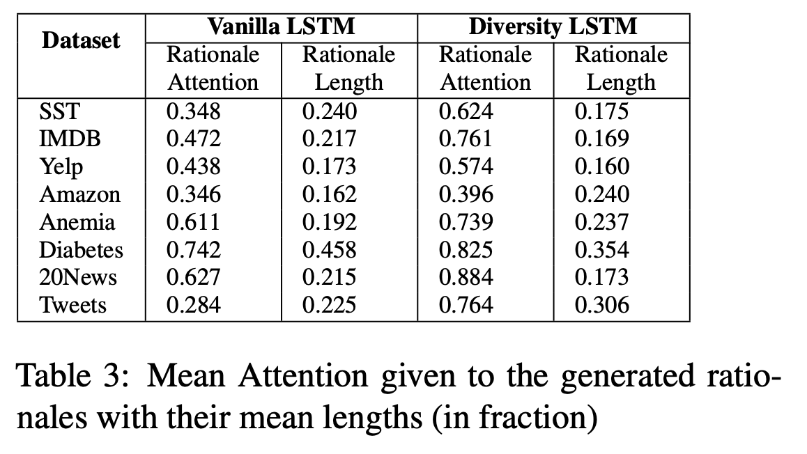
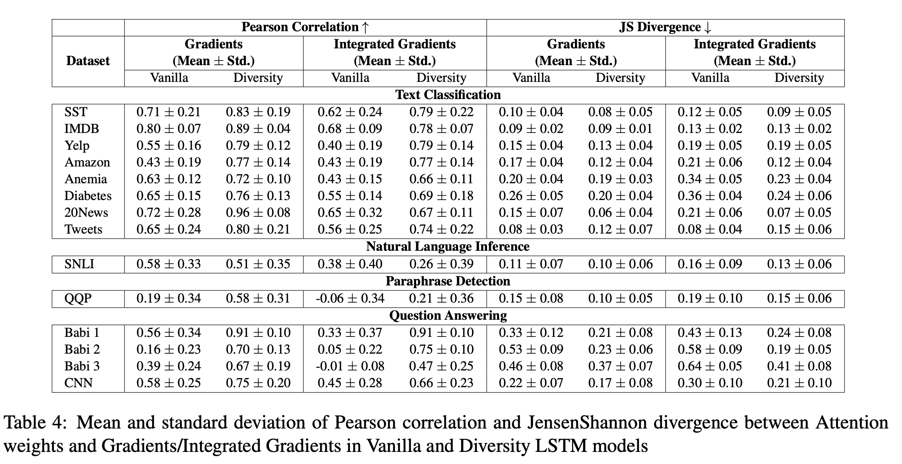

## Towards Transparent and Explainable Attention Models
### Mohankumar, Nema, Narasimhan, Mitesh Khapra, Balaji Vasan Srinivasan, Balaraman Ravindran 
### IIT Madras
### ACL 2020

**Whats New** This paper brings out reason behind why attentions mechanism are not faithful and plausible, and address this issue by introducing diversity in hidden representation

**Key Concepts**
* Attention distribution is considered to be "faithful" if higher attention weights implies a greater impact on model's predition.

* It is considered "plausible" if it provides human understandable justification for model's prediction.

* Conicity: As model takes sum of attention weighted hidden representations. Where attention weights are positive.  It suffers from conicity, where in it gets struct in a particular conical regition. Where there is higher concity, attention weights would cease to mean.

* Key Idea: Make each subsequent hidden representation as diverse as it can be. by subtracting a vector component projected on mean of all previous hidden vectors. 

**How it works** 
* Four different tasks (Binary Text Classification, NLI, Paraphrase detection, Question Answering) and several different datasets are considered. Few tasks require to operate on two sentences.

* LSTM model works with attention as follow:

    

* Conicity is the average consine similarity of each vector from its mean. 

    

* Diversity in hidden representation is introduced in following way after each sequential step in LSTM.

    

    * Which is illustrated in the following figure

    

        
        <em>Source: Author</em>
        

**Experiments and Results**
* Hypothesis 1: Tokens are removed based on their attention weights, and check when does the decision flips.

    

        
        <em>Source: Author</em>
        

    * As can be seen, diversity models are doing much better to identity important tokens, so decision gets flipped as early as possible.

* Hypothesis 2: How conicity is reduced, and not at the cost of impact on accuracy.

     

        
        <em>Source: Author</em>
        

    * As can be seen, Conicity goes down multiple times, and there is not much impact on accuracy. 

* Hypothesis 3: How results would be impacted if attention weights are permutated randomly. 

    

        
        <em>Source: Author</em>
        
    

* Hypotheis 4: Comparision with rationales, where rational means minimum set of words which required to make decisions. So, how rationale length and rational attention weights compares with vanilla LSTM and diverse LSTM

    

        
        <em>Source: Author</em>
        
 
    
* Hypotheis 5: Comparison of pearson correlation and Jensen Shannon divergence between gradient based importance and attention weights

    

        
        <em>Source: Author</em>
        
 

* Hypotheis 6: How diversity mechanism avoid unnceccesary weights to punctuation etc.
    * It is observed that the attention given to punctuation marks is significantly reduced from 28.6%, 34.0% and 23.0% in the vanilla LSTM to 3.1%, 13.8% and 3.4% in the Diversity LSTM on the Yelp, Amazon and QQP datasets respectively.

* Hypotheis 7: How human compare attentions weights of vanilla and diversity LSTM across overall plausibility and faithfulness, completeness, and correctness. 
    * Around 200 samples taken, each sample was reviewed by 3 humans, and majority vote was taken.
    * Diversity model outperformed vanilla significantly over all these three dimensions.

**Reflection**
* This is a simple but profound technique can helps in interpretability and attribution
* Need to see how it can be extended to transforerms model as well? How much conicity problem lies in transformer architecture, and how diversity can be applied. Just on the last layer, or at each layer etc.

