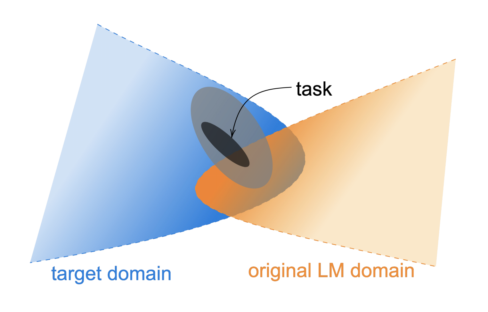
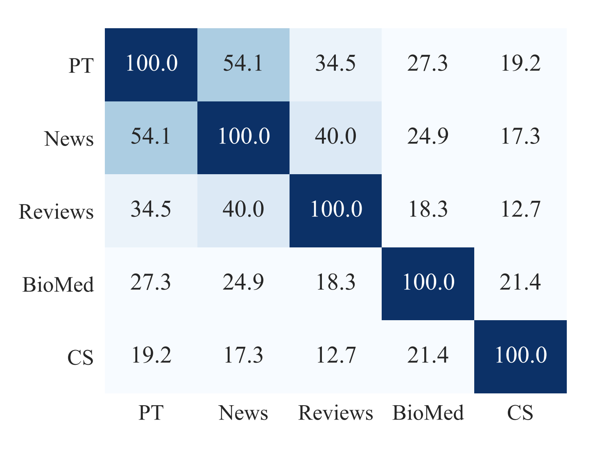
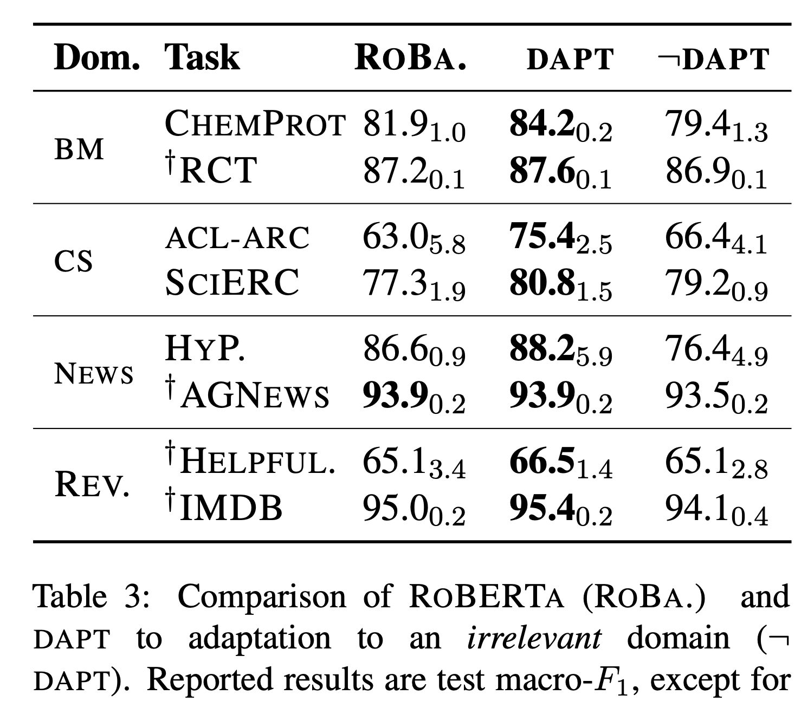
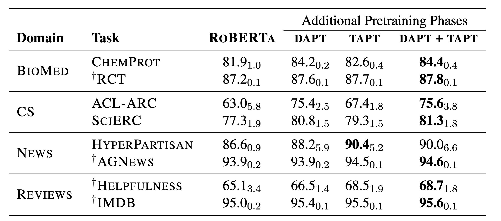
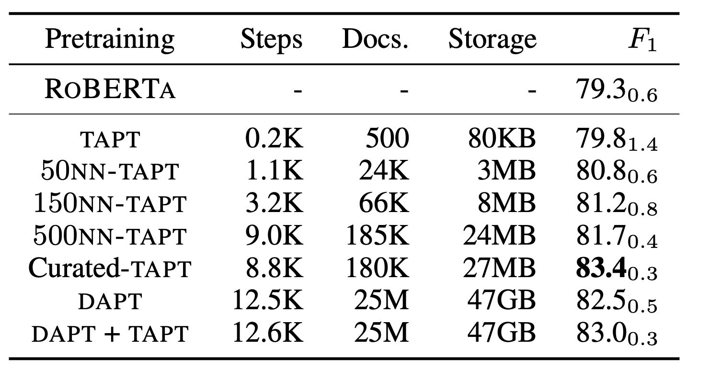

## Don’t Stop Pretraining: Adapt Language Models to Domains and Tasks
### Suchin Gururangan, Ana Marasovic, Swabha Swayamdipta, Kyle Lo, Iz Beltagy, Doug Downey, Noah A. Smith
### Allen Institute of AI
### ACL 2020

**Whats Next**
This paper presents evidence of domain adaptie pretraining, and task adaptive pretraining. Multi phase adaptive training does give better preformance.

**Key Insights**
* Following figure illustrate the intuition behind multi phase adaptive training
    

        
        <em>Source: Author</em>
        

* Domain Adaptive Pre-Training (DAPT)
    * Unlabelled data for the domain of task was taken.
    * Disimilarity of domain data with LM pretraining data was computed based on the top 10K vocabolary overlap
    * Following plot demonstrate it,
    

        
        <em>Source: Author</em>
        

    * Following table shows the impact of DAPT, and also rules out if the impact is just because of additional training. So, last column represent a disimilar-domain pre-training.
    

        
        <em>Source: Author</em>
        

* Task Adaptive Pre-Training (TAPT)
    * Second phase of pre-training based on the unlabelled training data of the task, which is masked out as per Roberta's need
    * 100 epochs are trained under TAPT phase
    * TAPT and DAPT together brings additional performance boost
    * Following table highlights performance improvement from TAPT, DAPT and both
    

        
        <em>Source: Author</em>
        

    * Also, following two more methods have been found effective
        * Unlablled data related to task is proven very effective. Sometime dataset creation involves creating a large pool of data, and selectively filter task specific data, in that case the original larger pool of data turns effective for boosting the performance.
        * Find out subset of in-domain data which is similar to task specific data  using embedding similarity also leads to improved performance. For each record in task, when top-K nearest neighbours were chosen, the gain in perfomance was reported as following.

    

        
        <em>Source: Author</em>
        

    

