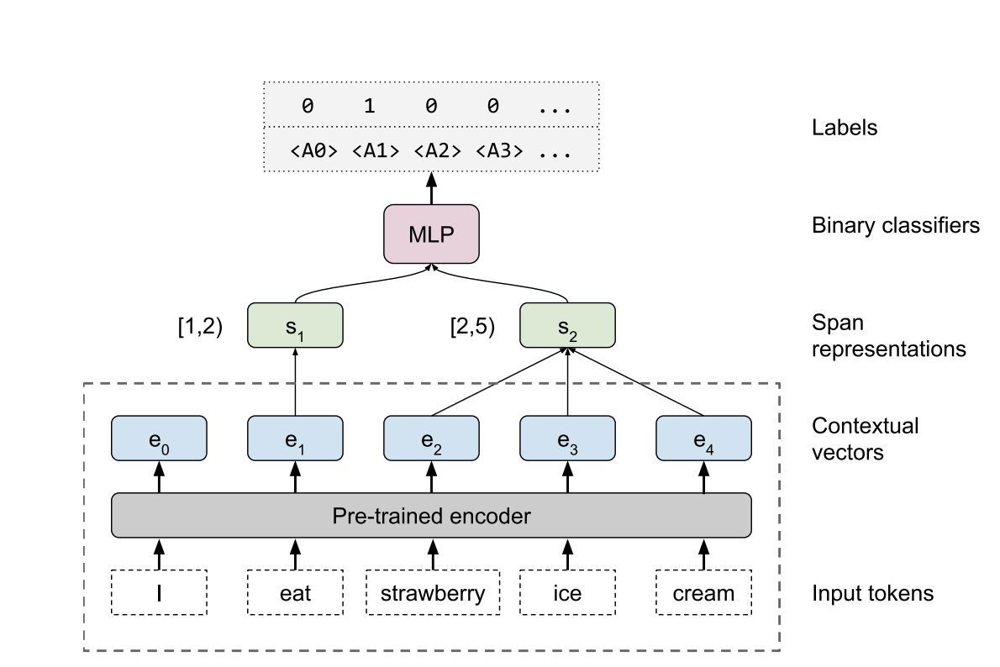

## What do you Learn from Context? Probing for Sentence Structure in Contextualized Word Representations
### Tenney et al
### ICLR 2019

**What's new**
A novel method to probe word level contextual representations on how much sentence level syntatic and semantic knowledge is encoded?

**Key Insight** Existing models produce strong representations encoding syntactic knowledge compared to semantic knowldge when they are compared with non-contextual baseline.

**How it works** 

* Following architecture illustrations explains the probing method.

<em>Source: Author</em>

* Tasks considered for probing
    * Part-of-speech tagging (POS) 
    * Constituent Labelling - span in a sentence
    * Dependency Labelling 
        * functional relationship of one token to other, i.e. modifier-head relation, subject-object relation
    * Named Entity Labeling
    * Semantic Role Labeling
        * Predicate-argument relation
    * Coreference
    * Semantic Proto-Role
        * Potential semantic attributes of predicate-argument relation. i.e. "Marry pushed John", i.e. pusher is "aware" that they are doing pushing.
    * Relation classification
        * Real world relation that exist between two entities

* Datasets used:
    * OntoNotes 5.0
    * English Web Treebank of Universal Dependencies 2.2
    * Relationship: SemEval 2010 Task 8
    * Winograd Schema

* Probing Model
    * Cove: Top level activations 
    * Elmo: Linear combination of Elmo layers with task specific learned scalar
    * GPT & BERT:
        * Cat - concatenate the subword embeddings with activations of top layer
        * Mix - linear combination of layer activation with task specific scalars

* Baseline
    * Lexical baseline:
        * Glove for Cove
        * Elmo: activation of context independenc character-CNN layer
        * Embedding layer of BERT and GPT of fully learned model
    * Randomized Elmo:
        * Elmo: Replace all layers above lexical layer ith randomised orthonormal weights
    * Word-level CNN
        * CNN on top of word representations with +-1 tokesn or +-2 tokens around the center word.

* Results
    * Major imporvements comes in syntactic tasks, whereas on semantic tasks, there is still much room left for improvement.
    * Architecture with random orthonormal wieghts does improve performance marginally over baseline
    * So, does CNN with surrounding 1 or 2 words adds to the performance. 
    * Overall, over ELMO, BERT and GPT, contextual words representations has proven to be benifical.

    

