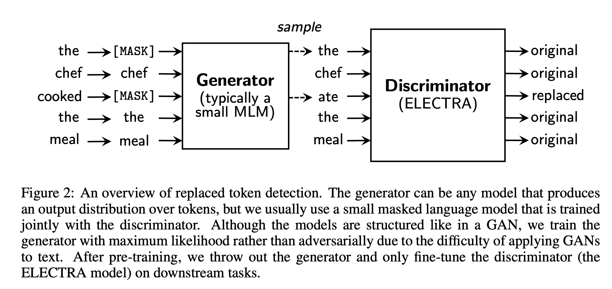

## ELECTRA: Pre-Training Text Encoders As Discriminator Rather Than Generators

### Kevin Clark, Minh-Thang Luong, Quoc V. Le, Christopher D. Manning
### Stanford, Google Brain, 2020

* Opportunities in BERT 
    * BERT's MLM is effective but require more compute.
    * BERT's objective is exposed to only 15% of tokens which are masked
* ELECTRA's take
    * Instead of masking out token, it would be replaced by a small generator
    * Electra's objective would be to detect if its generated or real. 
    * Objective function is computationally effective at learning
    * Objective function exposed learning to all the tokens, makes it effeciant.

* Architecture
    * It consists of a generator and a discriminator. Generator replaces masked tokens, and discriminator detects it. 

    

    
    

    * Generator:
        * It is not adversial generator, which try to fool discriminator, as sampling makes it complicated, so it is simpler MLE based generator which replaces randomly masked tokens with predicted tokens.
        * Generator can be lean and small. As, if it does a great job, Discriminator's scope would be affected.
        
        

        

    * Discriminator
        * It's a binary classification to predict on each token, as either it come from real data or is it genereated.

        

        

* Experiments shows generator of size 1/4 does better 

* Electra small takes just 4 days on 1 GPU V100 to get trained from scratch, and gives 79.9 performance on GLUE Benchmark.

* Electra can be thought of massively scaled up version of CBOW with negative sampling.

* It would be interesting to make Electra's generator auto regressive and add a replaced span detection task.

