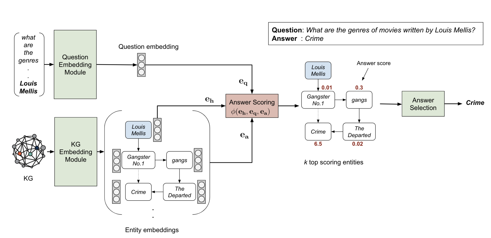

## EmbedKGQA: Improving Multi-hop Question Answering over Knowledge Graphs using Knowledge Base Embeddings
### Apoorv Saxena, Aditay Tripathi, Partha Talukdar
### ACL 2020

* EmbedKGQA is a novel method for multi-hop KGQA, which requries reasoning over multiple edges of KG, which is generally incomplete.
* It relaxes the requirement of an answer selection from a pre-specified local neighbourhood.

* Following image describes the solution architecture of EmbedKGQA

    

        
        <em>Source: Author</em>
        

* It consists of three modules
    * KG Embedding Module: creates embeddings of all the entities in KG
        * ComplEx embeddings is a tensor factorization approach, that embeds relations and entities in a complex space
    * Question Embedding Module: finds the embedding of a question
        * Question embeddings are learnt after passing it through Roberta, and four fully connected layers on top of it to project it on complex plane.
        * Question embeddings are learnt by a scoring function:
            * φ(e_h, e_q, e_a) > 0 ∀a ∈ A
            * φ(e_h, e_q, e_a¯) < 0 ∀a¯ not ∈ A
            * where, a are answer entities, h is head entitiy present in question
            * binary cross entropy loss is used.

    * Answer selection module: Reduce the set of candidates answer entities and selects the final anwer
            
        * where, a' are all possible answer entities

* Results:  
    * Its applied over MetaQA dataset, which is publicably available for 1-hop, 2-hop, and 3-hop question answering.
    * EmbedKGQA performed SOTA results, and it really brings huge value addion when the KG is sparse (which author demonstrate by removing 50% of edges)