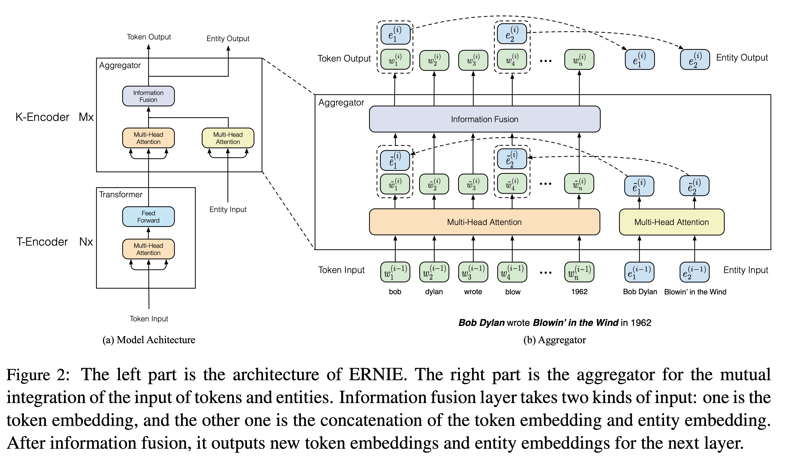
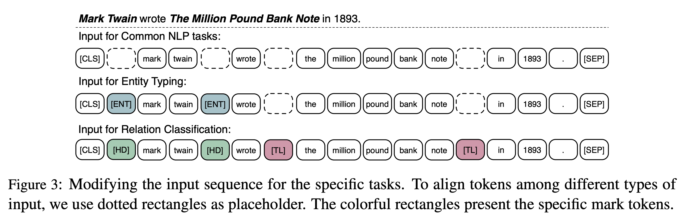

## ERNIE: Enhanced Language Representation with Informative Entities
### Zhengyan Zhang, Xu Han, Zhiyuan Liu, Xin Jiang, Maosong Sun, Qun Liu
### ACL 2019

**Whats new** informative entities in KGs can enhance language representation with external knowledge

**How it works** 
* Architecture: ERNIE has two encoders, 
    * T-Encoder: Where, contexualised embeddings are first learnt independent of mixing KG augmentatiom 
    * K-Encoder: Information fusion happens with KG entity embeddings, which are pretrained with TransE.
    * Architecture diagram can be seen as below:

    

        
        <em>Source: Author</em>
        

    * Token sequence {w_1, . . . , w_n}, and entity sequence {e_1, . . . , e_m}
    * Token entity alignment f(w) = e
    
        

        

    * For token with aligned entities, information is fused as follow

        

    * For token without aligned entities, fusion happens as follow

        

* Pre-training Objective (dEA):
    * dEA:
        * Given token sequence, and entity sequence, it needs to predict aligned entity. Its distribution is predicted by softmax.
        * 5% of time, token entity alignement is corrupted
        * 15% token-entity alignment is masked
        * 80% time, it is kept intact.
    * and, also MLM and NSP

* Fine-tuning tasks:
    * On NLP task, it follows normal BERT approach with CLS token in the begining.
    * For Relation classification, it introduce HD, and TL tokens as boundary markers, and take pooling on those, which then gets concatenated and given to classifier.
    * For Entity Typining, it just introduce ENT tokens as positional markers, and rest is similar.
    * Its illustration can be seen in following figure.

     

        
        <em>Source: Author</em>
        

* **Results**, ERNIE achieves better results on KG relationship classification, and entity typing tasks, where as it stays comparable for GLUE tasks. 
