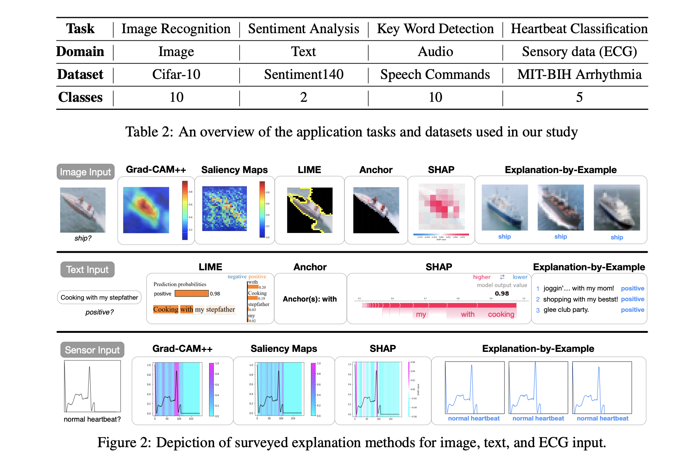
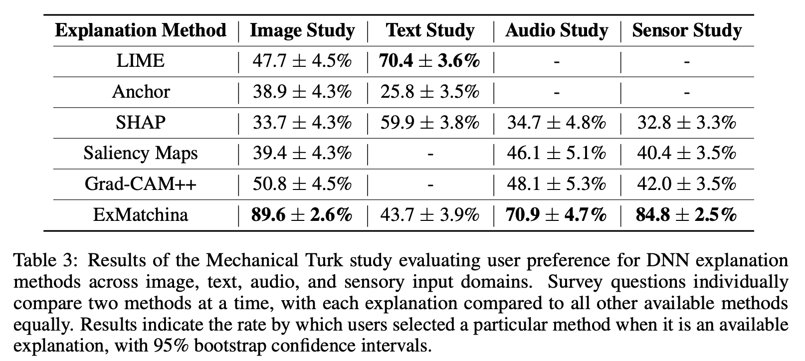

## How Can I Explain This to You? An Empirical Study of Deep Neural Network Explanation Methods
### Jeya Vikranth Jeyakumar, Joseph Noor, Yu-Hsi Cheng, Luis Garcia, Mani Srivastava, 
### NIPS 2020 [[arXiv](https://proceedings.neurips.cc//paper/2020/file/2c29d89cc56cdb191c60db2f0bae796b-Paper.pdf)]

**Whats Unique**
This paper categories popular six explanation methods into three categories, model-agnostic, model-transparent and explanation-by-example methods. And, it emperically validates on text, images, audio and sensory data by human label with Mechanical Turk.

It finds LIME is best suited for text, and explanation by examples are best suited for rest three domains, Image, Audio and Sensory.

**Taxonomy**
* Model Agnostic:
    * LIME
    * SHAP
    * Anchor
* Model Transparant
    * Saliency Maps
    * Grad-CAM++
* Explanations by Example
    * Cosine similarity of activations

**Datasets & Example Illustrations**

    
    <em>Source: Author</em>
    

**Results**

    
    <em>Source: Author</em>
    

**Concerns**
* Explanations by examples have potential risk of privacy breach, hence it may not be applicable for all the tasks. Also, it would expect rich training data with proper training data distribution.
