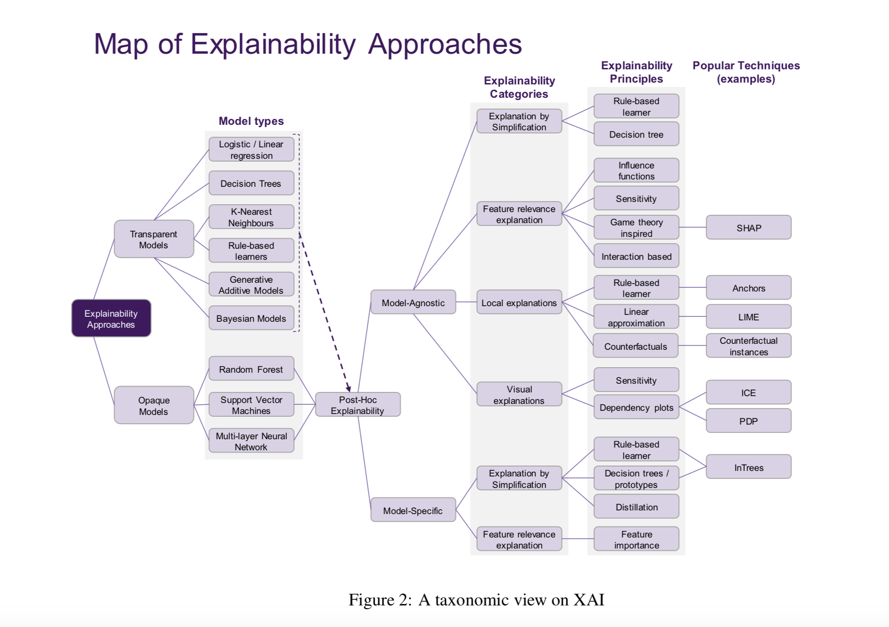
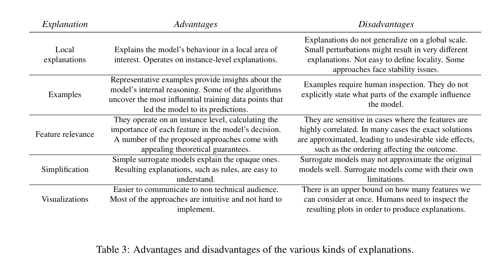

## Principles and Practice of Explainable Machine Learning
### Vaishak Belle, Ioannis Papantonis 
### 2020 [[arXiv](https://arxiv.org/pdf/2009.11698.pdf)]

**Whats Unique**
This is a review paper on explainable AI. It presents the need, current advances, theoretical foundation, taxonomies, and framework to appy explainable AI for the real world need.

* Critical concerns while deploying a product using AI models.
    * Correctness - Only variables of interest have taken part in decision making.
    * Robustness - Model is not susceptible to minor perturbations.
    * Bias - There do not exist data specific or other such bias.
    * Improvement - Whats the concrete way the prediction can be improved.
    * Transferability - In what way the predictive model for one domain can be transferred to the other domain.
    * Human Comprehensibility - Are we able to explain model's algorithmic machinery to an expert?

* Explainability is achieved by achieving transparcy in prediction decision making. Which depends on three parameters
    * Simulatability - Can model's ability be simulated by human?
    * Decomposibility - Ability to break model in to parts and then explain these parts.
    * Algorithmic Transparancy - Ability to understand the procedure the model goes through in order to generate its output.

* Evaluation Critria: Models can be evaluated in following aspects in terms of explainability
    * Comprehensibility: extracted representations are humanly comprehensible
    * Fidelity: The extent in which extracted representations are accurately capture the opaque models
    * Accuracy: The ability of extracted representations to predict unseen examples
    * Scalability: The ability of model to scale through large input spaces and large numbers of weighted connections
    * Generality: The extent in which model require special training.

* Taxonomy of XAI 

    
    <em>Source: Author</em>
    

* Types of Explanations - and its advantages and disadvantages
    

    
    <em>Source: Author</em>
    

* Transparent Models
    * Linear/Logistic Regression
    * Decision Trees
    * K-Nearest Neighbours
    * Rule-based learning
    * Generalised Additive Models
    * Bayesian networks
* Opaque Models
    * Random Forests
    * SVMs
    * Multilayer NNs

* XAI methods and its categorisation

    
    <em>Source: Author</em>
    

* Brief Overview of Deep Learning Models    
    * Model simplification
        * Neuron level Rule Extraction
        * CRED / DeepRED: Decision trees to represent the rule extracted.
        * TREPAN: Extract rules from the whole NN, treating it as a black box
        * HYPINV: Algorithm to produce rules in form of conjunctions and disjunction
    * Interpretable Mimic Learning:
        * Teacher student learning
    * Feature Relevance
        * DeepLift
        * Integrated Gradients

* Jane, The Data Scientist Scenario
    * Problem: whether a loan should be approved? Maximise performance and explainability.
    1) Transparent Model - performance was not satisfactory.
    2) Opaque Model - Random Forests.
    3) SHAP to exaplain each decision.
    4) Questions: Does model only depend on salary? How would model behave when the salary is low? ==> Individual Conditional Expectation (ICE), and visulise with Partial Dependence Plots (PDPs)
    5) A new question - why model rejected a candidate? => Counterfactual - which can test notion of closeness => missed payment was the reason.
    6) Whats model's behavior in the local area of salary and missed payment, i.e. if-then rules.
    7) Some data points are too noisy. What would be the impact if we remove them. => Deletion Diagnostics
    8) Describe model's behavior on global scale => inTrees
    9) 

* This paper lacks
    * Generating natural langauge explanations
    * Leveraging domain knowledge graph for the ease of explnations
    * Few categories of explanations
        * Probing
        * Features Interactions
        * Explnation augmented prediction
        * Explain then predict scenario
        * Model internal understanding
    * It does not dififerentiate interpretability vs explainability

