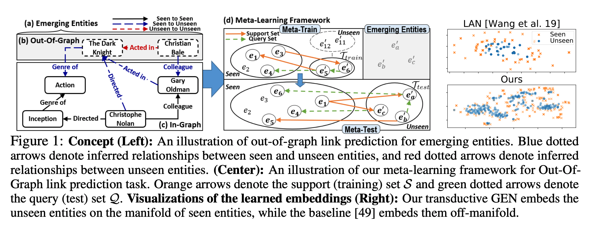
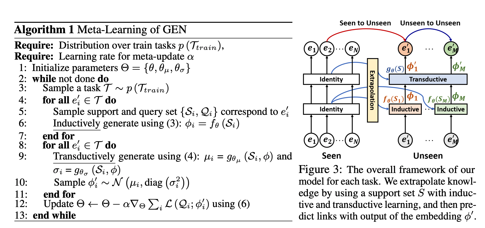

## Learning to Extrapolate Knowledge: Transductive Few-shot Out-of-Graph Link Prediction
### Jinheon Baek, Dong Bok Lee, Sung Ju Hwang
### NIPS 2020 [[arXiv](https://arxiv.org/pdf/2006.06648.pdf)]

**Whats Unique**
This paper gives a framework Graph Extrapolation Network (GEN)  and experimental validation of inductive and transductive learning for knowledge graph link prediction task.

**Major Contribution**
* Few shot out-of-graph link prediction aiming to perform link prediction between unseen entities for multi relational graphs.
* A novel meta learning framework Graph Extrapolation Network (GEN), which meta-learns the node embeddings for unseen nodes, and a low error on link prediction for both seen-to-unseen (inductive) and unseen-to-unseen (transductive) cases.

**How It Works**

* Following both figures complete understanding of the framework, which basically involve simulating task of seen-to-unseen from the training data, and also then extending the model to unseen-to-unseen task, in a meta learning framework.

    
    <em>Source: Author</em>
    

    
    <em>Source: Author</em>
    
