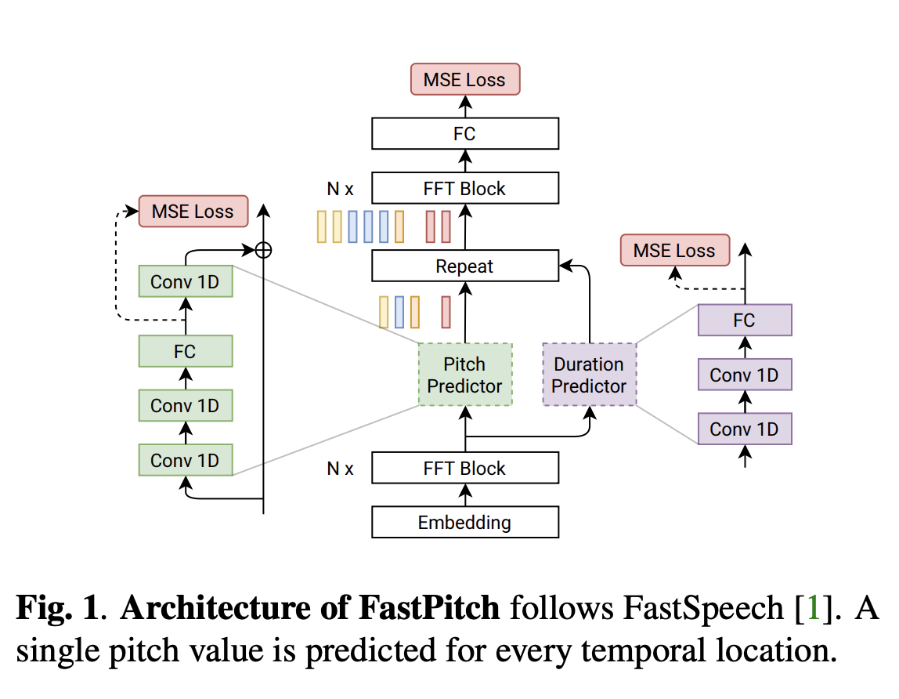

## Fastpitch: Parallel text-to-speech with pitch prediction.
### Łańcucki, Adrian
### In ICASSP 2021-2021 IEEE International Conference on Acoustics, Speech and Signal Processing (ICASSP), pp. 6588-6592. IEEE, 2021 [[Arxiv](https://arxiv.org/pdf/2006.06873.pdf)].

**Whats Unique**
Fastpitch is a fully parallel approach for text-to-speech model, it is based on fastspeech and conditioning the fundamental freuqency contours. 

**How it works**
* It is inspired from fastspeech, where it has two Feed Forward transformer blocks, one in the dimensionality of input, and another in the dimensionality of the output. 
* It uses duration predictor, similar to fastspeech, where it uses a trained Tacotran2 model for the same.
* It does not require knowledge distillation approach for mel-spectrogram prediction, which is there in the fastspeech.
* Instead, it has pitch prediction module, which is trained alogn with, where ground truth pitch is derived for each input value.
* It is similar to fastspeech2 model, where pitch was predicted not for each value, but for each spectogram frame, which makes it bit costly.
* Architecture diagram is as follow:

    
    <em>Source: Author</em>
    

* Ground truth for the pitch prediciton per input value:

    
    <em>Source: Author</em>
    

* Predicted pitch is added to the hidden representation from the first FFT block, and after which it is upsampled by the duration predicted for each input value.

* Its inference is 900 times faster than Tacotron2.