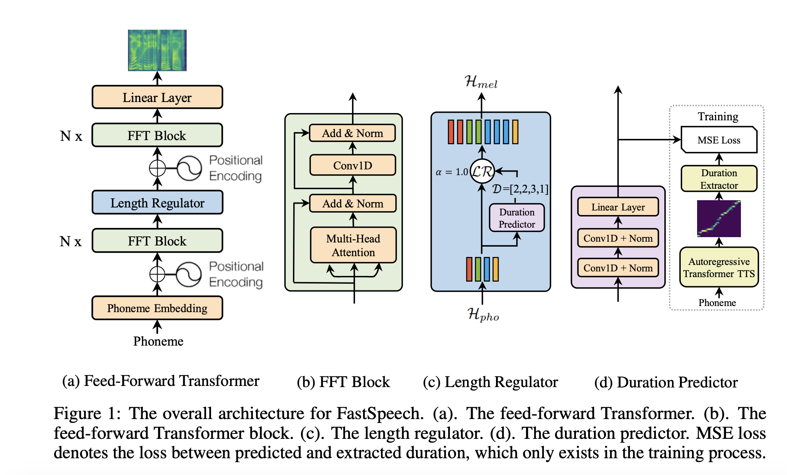

## Fastspeech: Fast, robust and controllable text to speech.
### Ren, Yi, Yangjun Ruan, Xu Tan, Tao Qin, Sheng Zhao, Zhou Zhao, and Tie-Yan Liu.  
### arXiv preprint arXiv:1905.09263 (2019) [arXiv](https://arxiv.org/pdf/1905.09263.pdf)

**Whats New**
Fastspeech is a non-autoregressive model for text to speech. It achieves 270 times higher inference speed for mel-spectogram generation, and reduce overall text to speech time by 38 times.

**How does it work**
* Generally TTS models are of encoder-decoder settings, but this model is just feed-forward architecture.
* It uses self-attentions and 1-D convolutions in its architecture
* It has first 6 layers to process text-phonemes, followed by length predictor which uses a trained auto-regressive TrasformerTTS model, to predict duration for each phoneme.
* Further, it has more 6 layers to generate mel-spectograms.
* It uses trained TrasnforerTTS for two reasons, 1) to train length predictor model with MSE loss, 2) to train mel-spectograms in teacher-student setup, for effectiveness of distillation.
* Architecture diagram can be seen as follow:

    
    <em>Source: Author</em>
    

