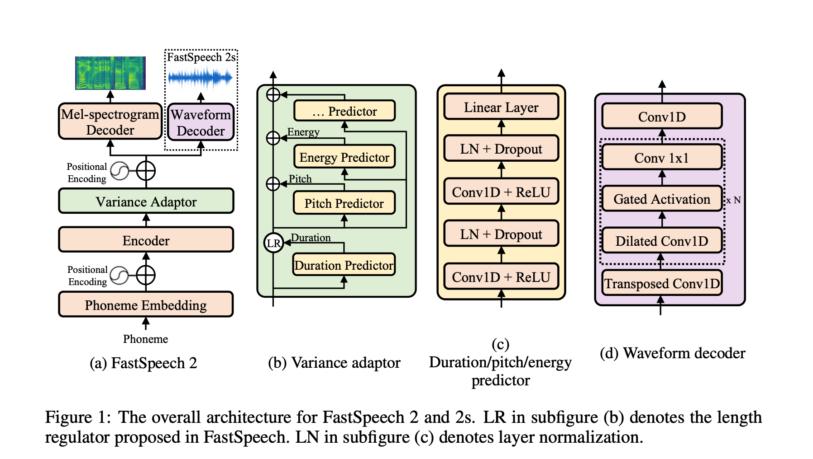

## Fastspeech 2: Fast and high-quality end-to-end text to speech.
### Ren, Yi, Chenxu Hu, Xu Tan, Tao Qin, Sheng Zhao, Zhou Zhao, and Tie-Yan Liu. 
### arXiv preprint [[arXiv:2006.04558](https://arxiv.org/pdf/2006.04558.pdf)] (2020).

**Whats Unique**
This paper further extends the research to get non-autoregressive TTS model. It extends the architecture of Fastspeech. It mainly has three difference, 1) does not use teacher-student pipeline for traing, 2) directly use duration from the waveform, 3) does not use knowledge distillation on mel-spectogram. It has also experimented to directly generate waveform from internal represetnation. 

**Key Contributions**
1. Completely non-autoregressive pipeline, i.e. Fastspeech/fastpitch depends on auto-regressive model for the duration ground truth. Fastspeech2 uses "Montreal Forced Alignment" (MFA) method to get the duration from the waveform.
2. It has an extensible architecture, which already uses duration/pitch/energy as internal module to help better quality speech.
3. Fastspeech 2s directly outputs waveform, instead of mel-spectograms.
4. Architecture of Fastspeech 2 is as below:
 

        
        <em>Source: Author</em>
        

5. Duration predictor: MSE loss on the Ground Truth value of duration computed using  "Montreal Forced Alignment" (MFA). Upsampling is done to accomodate duration.
6. Pitch Predictor: Use CWT (Continuous wavelet transform) to decompose the continuous pitch series into pitch spectogram as the target to be learned with MSE loss. During inference time, pitch spectogram is predicted and it is transformed to pitch counter using inverse counter wavelet transform (iCWT). Values of F0 of each frame is quantized to 256 values with log scale to take it as pitch counter input. Pitch embeddings are added to the hidden representation. 
7. Energy Predictor: Compute L2 norm of amplitude of each STFT frame as enegry. Energy embeddings are added to the hidden representation.

**Training Time**
* It takes only 17 hours on single V100 GPU to train the model end to end.

**Results**
* It outperforms Tacotron2, TrasnformerTTS and Fastspeech, with much lesser training time.