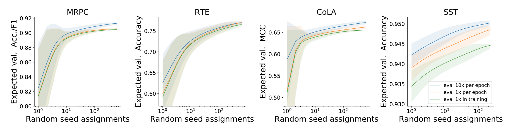

## Fine-Tuning Pretrained Language Models: Weight Initializations, Data Orders, and Early Stopping
### Jesse Dodge, Gabriel Ilharco, Roy Schwartz, Ali Farhadi,  Hannaneh Hajishirzi, Noah Smith
### 2020

**whats new** This paper shows that random initialisation of weights of fine tuning layer and data order for fine tuning has significant impact on validation performance. It suggest early stopping as a possible mean to avoid lower performing models.

**how is it done**Authors conducted around 2100 experiments over four GLUE data sets and found huge variance in fined tuned model performance. Best performing models are also outperforming SOTA models performance. 

  

    
    <em>Source: Author</em>
    

**key insights**
1. Number of trials to best validation perforamnce has good correlation.
2. Both, WI and DO adds to the validation performance variance comparably.
3. It is statistically signifanct proof that best performing model differ from lower performing one where just WI and DO has changed.
4. There is a good correlation of model's performance after 0.5 epoch in three smaller dataset, and after 2 epoch in larger dataset with final performance. That can be leveraged for early stopping.

