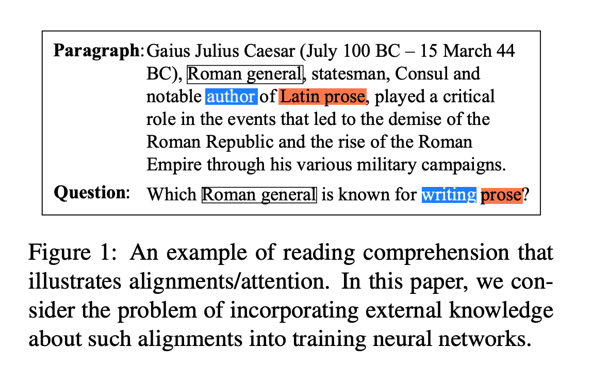
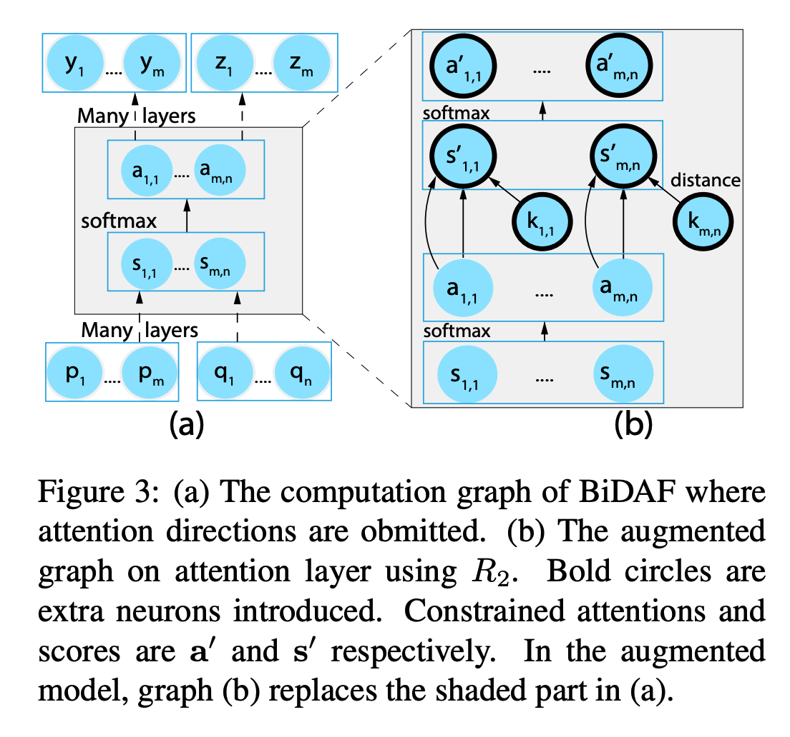
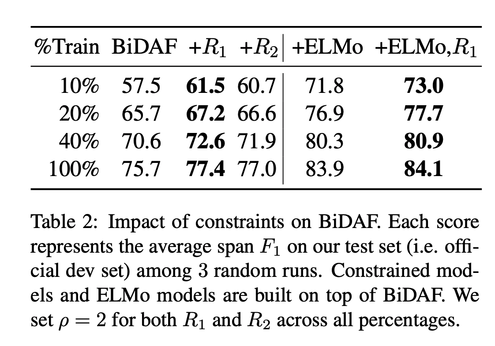
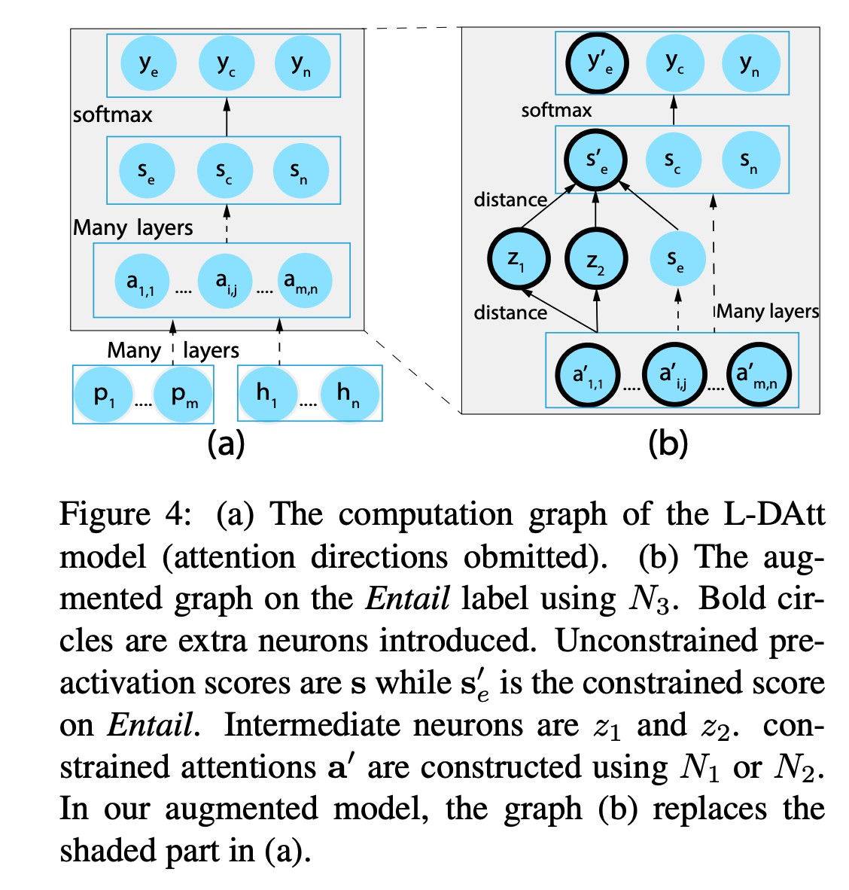

## Augmenting Neural Networks with First-order Logic
### Tao Li, Vijay Srikumar
### 2019, [[arXiv](https://arxiv.org/pdf/1906.06298.pdf)]

**Whats New**
It gives a framework to augment neuron with a rule from external knowledge, and proves its effectivenss specifically with the lesser training data.

**Illustrative Example**
    

    
    <em>Source: Author</em>
    

**Major Contribution**
* Framework incorporating first-oder logic rules into neural network design
* Experiments on augmenting neural network with first order logic at following three levels:
    * intermediate decisions (i.e. attentions);
    * output decisions constrained by intermediate states
    *output decisions constrained using label dependencies
* Validation of the framework on three use cases

**How It Works**
* Augmenting Attentions
    

    
    <em>Source: Author</em>
    

    * As can be seen above, attentions are modifed with external knowledge, rules can be specified as follow
        

    * Where, K_ij is the external knowledge between tokens i and j, let say word relatedness from conceptnet.

    * Following results wehre achieved.
    

    
    <em>Source: Author</em>
    

* Output decisions at Intermediate States
    

    
    <em>Source: Author</em>
    

    * As can be seen, it directly modifies output decision, it can take augemented attention as inputs.

