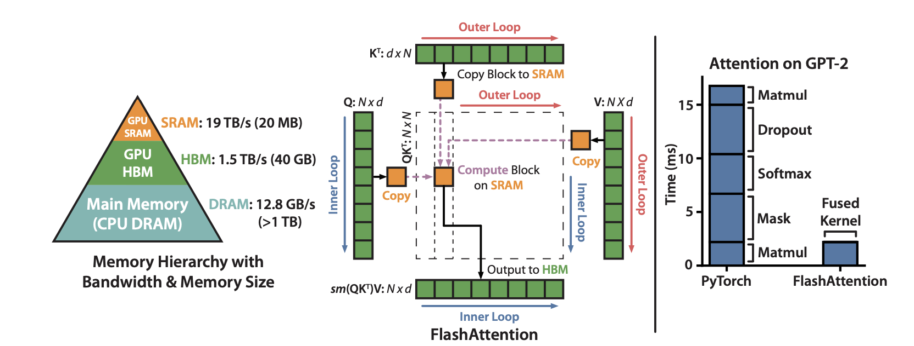

## "Flashattention: Fast and memory-efficient exact attention with io-awareness."](summary/flash.md) 
### Dao, Tri, et al. 
### Advances in Neural Information Processing Systems 35 (2022): 16344-16359. [[PDF](https://proceedings.neurips.cc/paper_files/paper/2022/file/67d57c32e20fd0a7a302cb81d36e40d5-Paper-Conference.pdf)]

**Key Points**
* It makes the attention computation IO-aware. Which does increases the FLOPs requirement marginally but it better exploits the IO.
* Computing attention uses Q,K,V, with following operations

    

    

    

* Above computations materialises S, and P first, and then compute O. S and P are io-intensive and require more memory as well. 

* Flashattention iterate over blocks in K and V in the outer loop and over Q in the inner loop. It locally commpute softmax, and stores the weights needed compute softmax, S and P during back propagation. 

  

        
        <em>Source: Author</em>
        

* It speeds up 7x for the attention computation. And, overall it gives 15% end to end speed up for BERT-large, and 3x speed up for GPT-2. 

* Furthermore, as an extension, it can skip the computation for blocks where the attention mask is all 0. That gives block sparse flashattention which is even faster. 