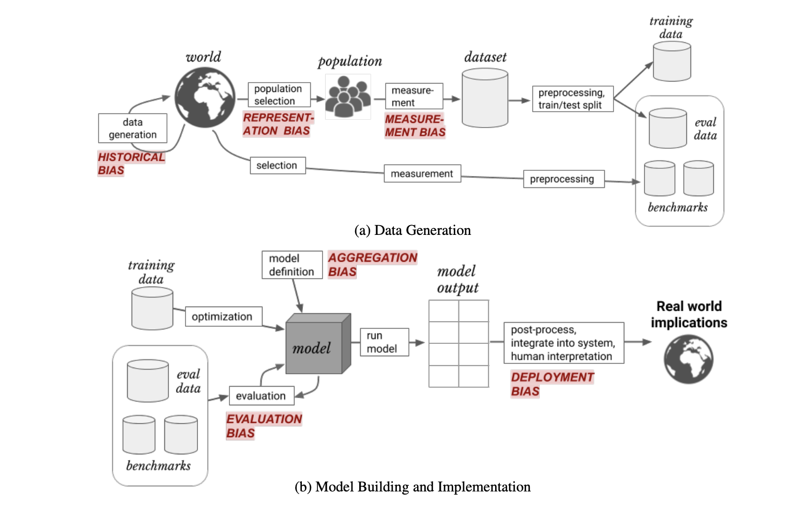
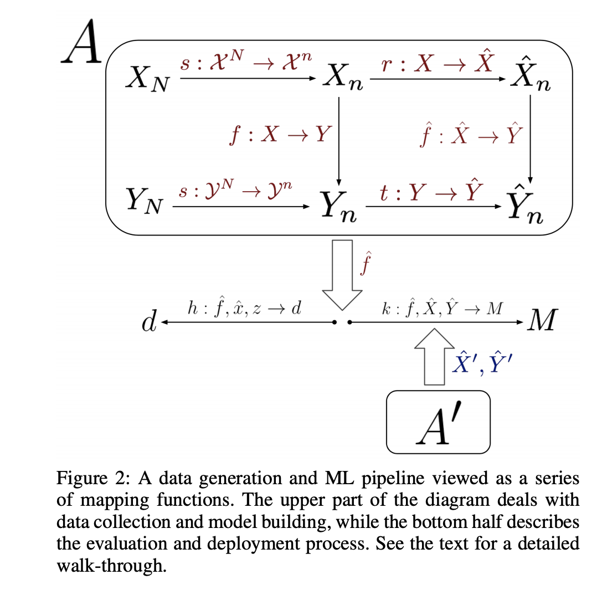

## A Framework for Understanding Unintended Consequences of Machine Learning
### Harini Suresh, John V. Guttag
### 2020

**Whats Unique**
This paper formalise the machine learning pipeline and how different kinds of bias gets introduced at vairous stages and how it impacts the real world scenarios. And, how to mitigate by improving the right stage of the ML pipeline.

**The Framework**
* Historical Bias:
    The difference between the world as it is and the values and objectives to be encoded and propogated in the model.
    * Example: Gender Bias, i.e. query "CEO" in google search.

* Represenation Bias:
    It is introduced while defining or sampling the population.
    * Example: Images in ImageNet.

* Measurement Bias:
    It is incurred while choosing and measuring features and the bias.
    * Example: "Arrest" is often inferred as "Crime"

* Aggregation Bias:
    During model construction when distinct populations are inappropriately combined. Sometimes single model is unlikely to suit all subgroups.
    * Example: Diabetic patients and associated complications based on ethinicity.

* Evaluation Bias:
    When evaluation population and performance metrics are not appropriate for the real world scenario where model will be used.
    * Example: evaluation of facial recognition system. Only 4% dark skinned females.

* Deployment Bias:
    It gets introduced when a deployed model gets used for some inappropriate ways.
    * Example: using system build for liklihood of committing crime to determine "length of a sentence".

Following figure visulislize these bias:

    
    <em>Source: Author</em>
    

Following figure formalise all these biases:

    
    <em>Source: Author</em>
    

    