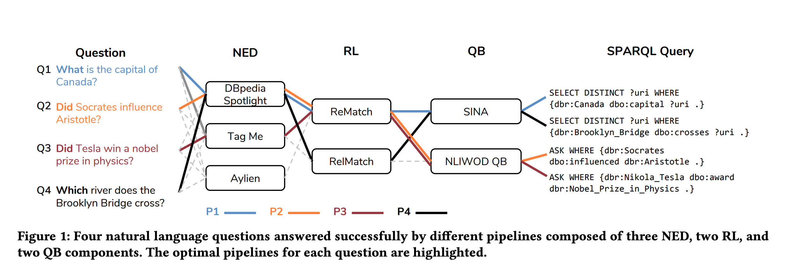
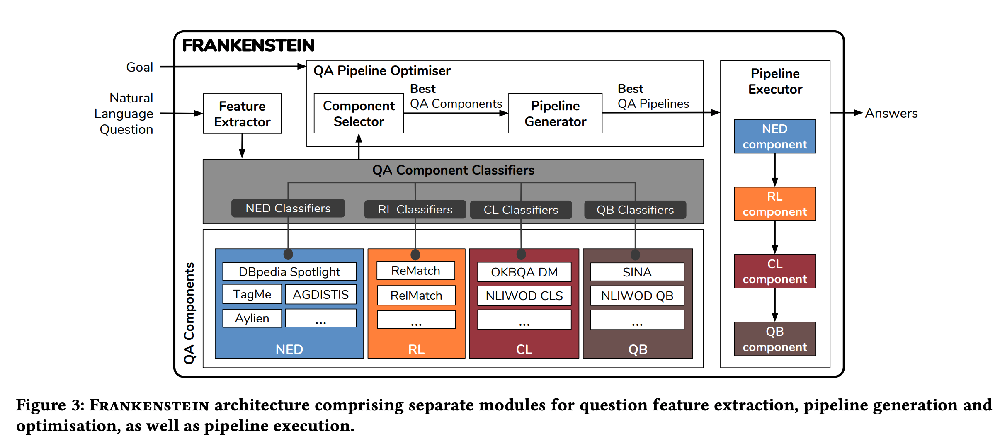

## Why Reinvent the Wheel – Let’s Build Question Answering Systems Together
### Kuldeep Singh et al.
### IW3C2 2018 [[arXiv](http://jens-lehmann.org/files/2018/www_qa_pipelines.pdf)]

**Whats Unique**
This paper present an emperical system towards question answering by arranging a pipeline of tasks, and evaluating re-usable components for each tasks, and thus solving QA with high performance.

**How It Works**
* Following figure gives a really good illustration.
* As shown, there are three tasks needed to solve, and each task have different components implemented.
* Different questions can be answered by invoking different components at each task.
    

    
    <em>Source: Author</em>
    

* Architecture is illustrated in the following figure
    * For each questions, features like question length, question word, answer type, POS tags etc have been extracted, and each components performance was predicted based on supervised learning framework.
    * That gives performance estimation for each components.
    

    
    <em>Source: Author</em>
    

* System is evaluated on LC-QuAD and QALD-5 datasets, and improvements and relative performance of about 15% was improved.

