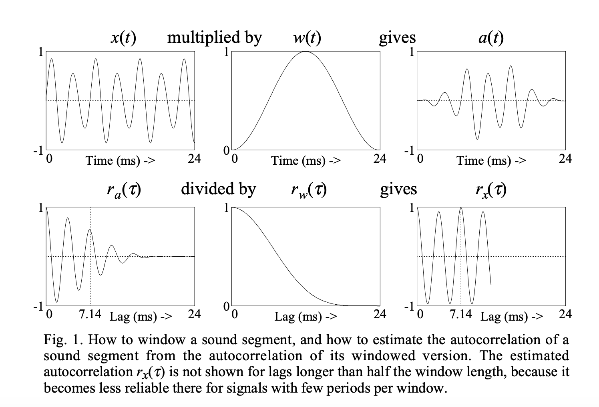

## Accurate short-term analysis of the fundamental frequency and the harmonics-to-noise ratio of a sampled sound
### Boersma, Paul.
### In Proceedings of the institute of phonetic sciences, vol. 17, no. 1193, pp. 97-110. 1993. [PDF](https://citeseerx.ist.psu.edu/viewdoc/download?doi=10.1.1.218.4956&rep=rep1&type=pdf)

**Whats Unique**
This paper layous out mathematical technique to extract the fundamental frequency and harmonics to noise ratio for any given window of the signal.

**How It Works**
* Autocorrelation and Periodicity: Autocorrelation would be maximum at the time lag of 0, so normalized auto-correlation can be computed by dividing it.

    

* Noise: Generally, signal would have noise into it. And, if noise is cancelling out each other, then we would find the maximum autocorrelation at the T0 which is the fundamental fequence of the signal. r'_x(T0) would be equal to the share of autocorrelation due to the signal.

    

* Harmonics ratio can be derived as, 
    

* Window function w(t) (hanning window or sine-squared window) is applied to get windowed signal

    

* Normalized auto-correlation on the windowed signal is computed

* Nomralized auto-correlation of the window function w(t) is also computed, and, it is divided to nullify the effect of window in the auto-corrlation

    

* Fundamental freq is derived where r_x(t) is maximum apart from zero.

* Following figure gives detailed illustration.

    

    
    <em>Source: Author</em>
    

