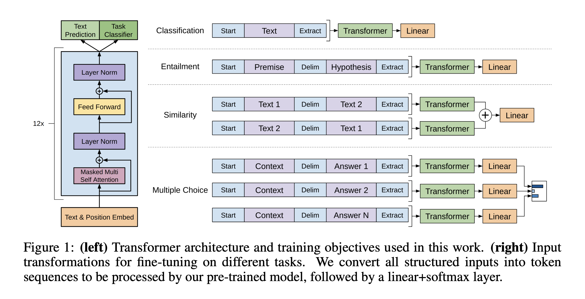

## Improving Language Understanding by Generative Pre-Training
### Alec Radford, Karthik Narasimhan, Tim Salimans, Ilya Sutskever @ OpenAI, 2018

* GPT was one of the first paper to leverage transformer-decoder architecture to train left-to-right language model and further reinforce concept of generative pre-training and discriminative fine-tuning.

* Generative pre-trarining:
    * It is trained with language model objective which is supervised pre-learning which can be applied on raw data.
    
    
        

        

    * As shown above, W_e is word embedding matrix, and W_p is positional embeddings. Token u is predicted given prior tokens.

* Supervised fine-tuning
    * Labels y is available for input sequence x_1, .. x_n. Inputs are transformed using transformer block activations, and are passed to linear output layer with parameters W_y to predict y.

        

    * Objective is to maximize log-liklihood of the probabilities of these labels.

        

    * **Auxiliary Objective** in fine tuning phase improves results by (a) improving regularization, (b) accelerating convergence. 

        

        * Where, L2 is task specific objective and L1 is language model objective serving as auxiliary objective in fine tuning mode.

    * Architecture of GPT is seen in image below: 
    
        * Question similarity task is fed into transformer as two independent sequences, and which are then fed to a linear block to classify into similar or disimilar.
        * Multiple choices questions are passed as independent sequences for each answer option to linear blocks, which further given to softmax layer to get probability distribution.

* Analysis: 
    * It shows number of layers in transformer blocks positively impact output.
    * Also, pretraining updates also helps task performance. and, transformer block is more effective then LSTM block.
    * Alation study was carried out to establish following:
        * Transformers without pre-tranining (-14%)
        * Transformer without auxiliary language modelling objective (~%)
        * replacing LSTM with aux LM. (-6%)

* GLUE SOTA was taken from 68.9 to 72.8% performance