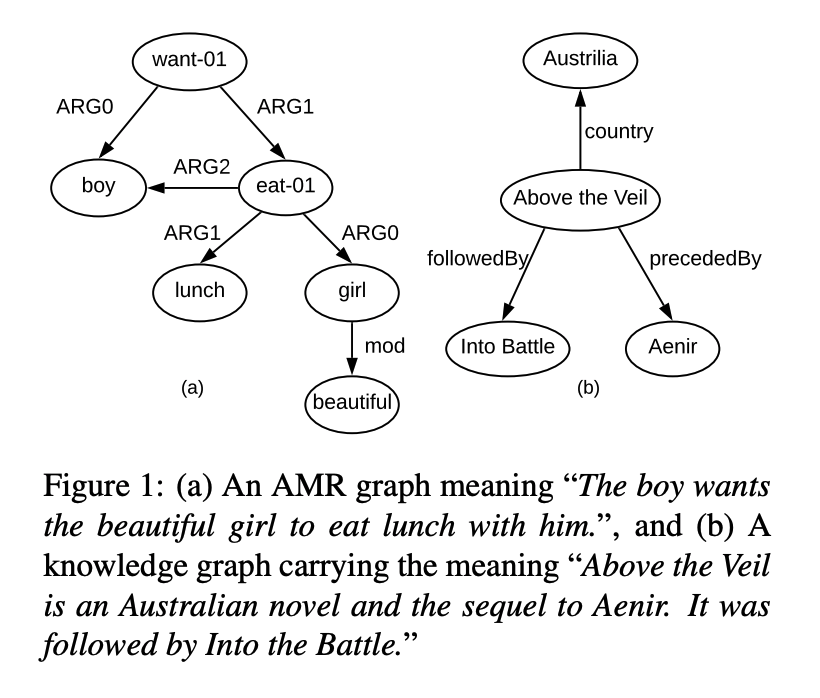
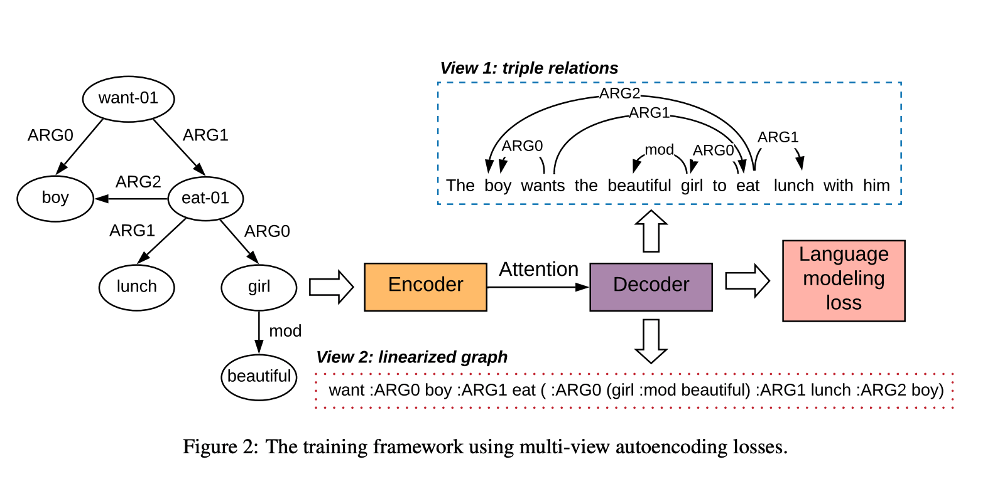
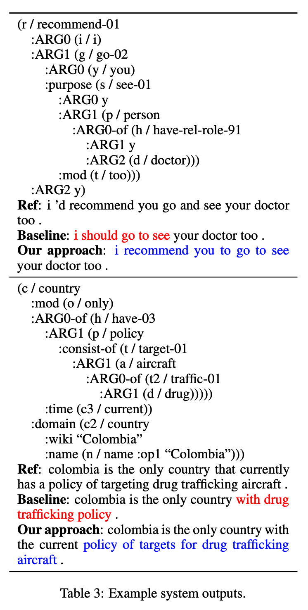

## Structural Information Preserving for Graph-to-Text Generation
### Linfeng Song et al., 
### ACL 2020 [[arXiv](https://www.aclweb.org/anthology/2020.acl-main.712.pdf)]

**Whats New**
This paper proposes two kinds of autoencoder losses for local and linear structure of the graph for the problem of graph to text generation.

**Background**
* Many text generation processes takes graph as an input
* Abstract Meaning Representation (AMR) text generation is one such problem.
* Following figure explains the problem statement
    

    
    <em>Source: Author</em>
    

* Graph and expected statement to be generated in the figure above.

**Base: Structure Aware Transformer**
* structure aware encoder:
    
    * hidden state where its attention weighed sum of hidden states of previous layer and also the vector represenation of relations lambda_i_j between node vi and vj
    * Attention weights are computed using query and key. 
        * Query: based on hidden state of previous layer
        * Key: based on hidden state of previous layer and vector represenation of relations.

    * Relation aware self attention:
    

* Standard decoder:
    * Given hidden state of s i-1, and previously generated vector y_i-1, it generates y i, and s i

        

* Standard langauge modelling loss

    

* Multi view auto-encoding losses:
    

    
    <em>Source: Author</em>
    

    * Loss 1: Reconstructing two loss relations
        
        * Computes probability of an arch between i and j, and then the label between i and j.

    * Loss 2: Linear graph sequence generation

        

        * sequence x_i can be token, bracket or relation. As shwon in the figure with dotted box view 2.

* Final training loss is weighted average of all the three losses

    

* Impact of these additional two losses can be seen in the following figure, where x axis are the weights

    

    
    <em>Source: Author</em>
    

* Examples of input graph, reference and output can be seen as below:
    

    
    <em>Source: Author</em>
    

    
