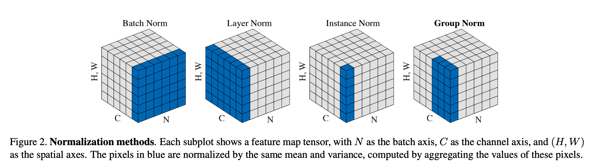
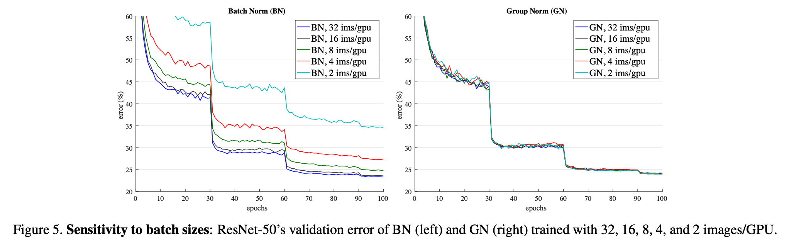
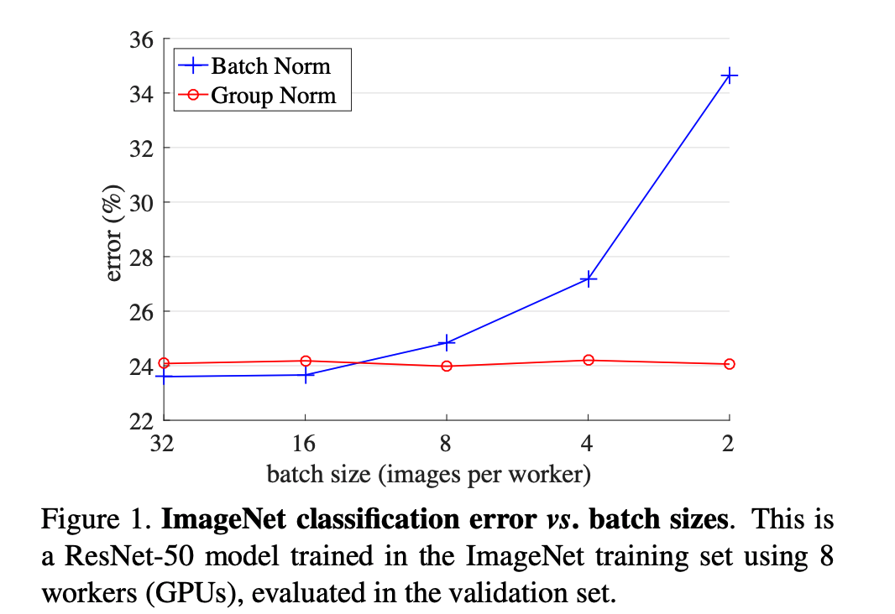

## Group Normalization
### Wu, Yuxin, and Kaiming He.
### European conference on computer vision (ECCV). 2018. [[arXiv](https://arxiv.org/pdf/1803.08494.pdf)]

**Whats Unique**
This paper presents a novel technique - Group normalisation, which normalise features across channels, (or, let say embedding dimesions) instead of normalising it across the batch level. Hence it is batch agnostic and works effectively in comparison to Batch Norm when batch size is small.

**How It Works**
* Following figure illustrates four different types of normalisation.

    
    <em>Source: Author</em>
    

* Formulation
    * Each sample x_i is normalised as follow: 
    

* Results:
Following figure shows the stability of Group Norm at different batch size (ofcourse, since it is batch-agnostic)

    
    <em>Source: Author</em>
    

In the following figure, we can see how group norm outperform batch norm for smaller batch sizes.

    
    <em>Source: Author</em>
    

