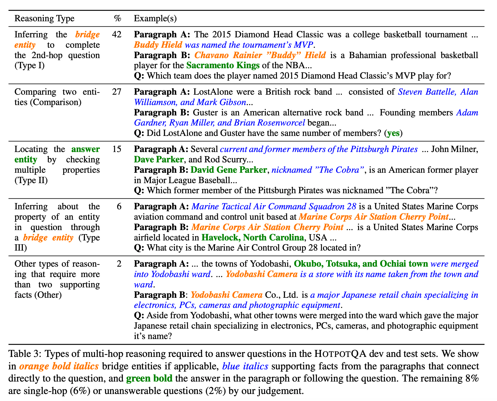
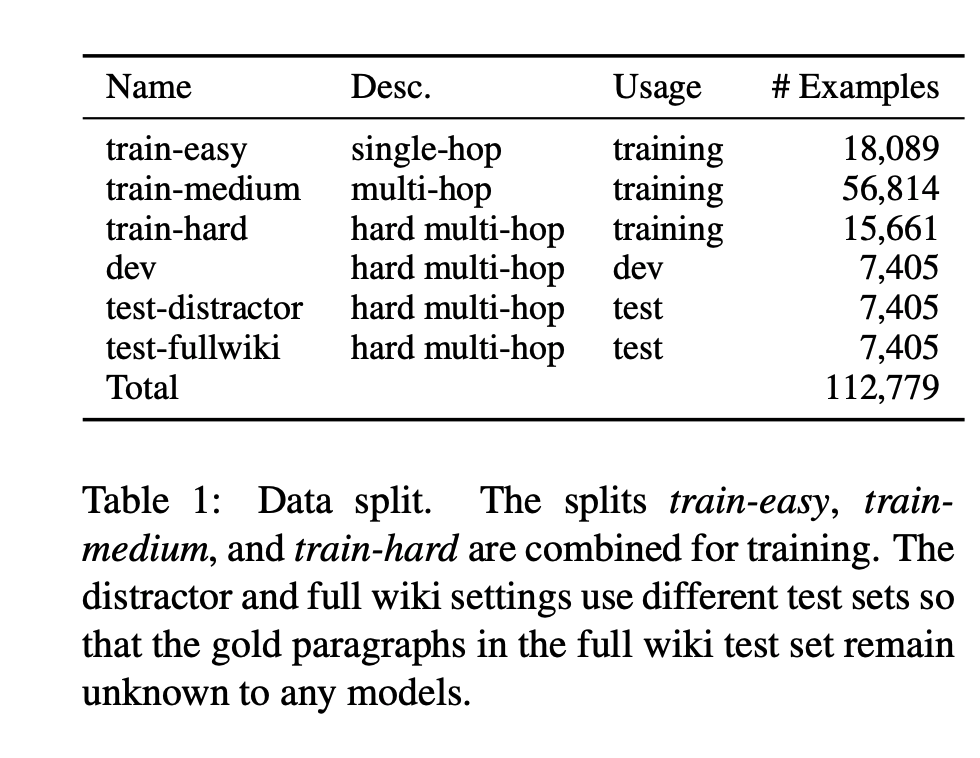
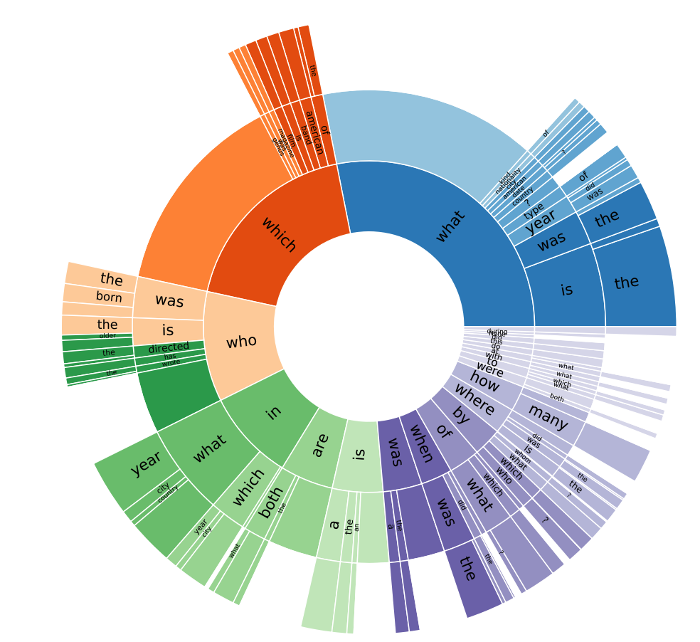
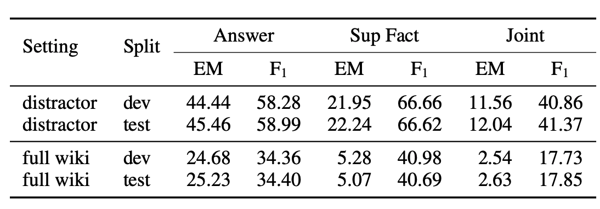

## HOTPOTQA: A Dataset for Diverse, Explainable Multi-hop Question Answering
### Zhilin Yang, Yoshua Bengio, Christopher D. Manning et al
### ACL 2018 [[arXiv](https://arxiv.org/pdf/1809.09600.pdf)]

**Whats New**
The dataset for multi hop question answering consisting 113K wikipedia based question answer pairs, with supporting facts.

**Examples**
Following table shows different types of multi-hops questions answers
    

    
    <em>Source: Author</em>
    

**Process**
* 112779 valid examples are collected over Amazon Mechanical Turk using ParlAI interface.
* Random samples (3-10) per Turker from top contributing turkors. and categorised all their questions into train-easy set if overwhelming percentage of their questions can be answered with single hop. 18,089 TrainEasy.
* QA model with SOTA architecture was implemented, and 60% question were correctly answered, categorised as TrainMedium.
* Rest are divided into train-hard, dev, train-distractor, train-fullwiki.
* test-distractor - 8 distractors paragraphs are selected based on bigram-tf-idf retrieval.
* test-fullwiki - no pragraphs are given. Full wiki should be used for the same.

    
    <em>Source: Author</em>
    

    
**Question Type Analysis**
* Central question word (CQW) was identified with some heurisitcs. Question type was identified using neighbour words to CQW. Following figure displays different question types.

    
    <em>Source: Author</em>
    

**Baseline Model Architecture**
* It first encodes pargraphs and questions seperately
* Bi-attention, it merges them
* Self attention contexulises them better
* RNN to emit supporting facts
* Three linear classifier for start token, and yes/no/spam 

    
    <em>Source: Author</em>
    

* Ablation study provides impact of each design choices.
* Baseline performance was as below. For both the test sets, test-distractor and test-fullwiki.
* Table below shows performance matrics for Answers, and Supporting Facts and both together. 

    
    <em>Source: Author</em>
    

