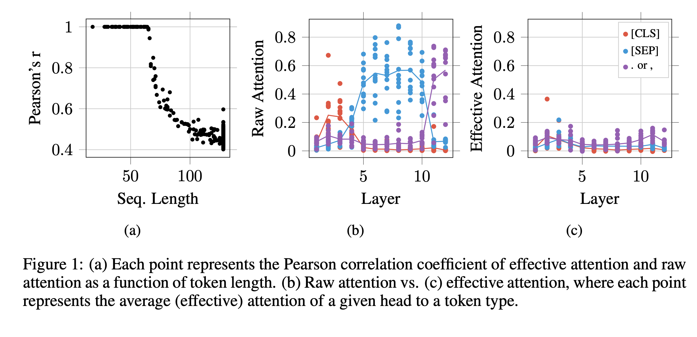
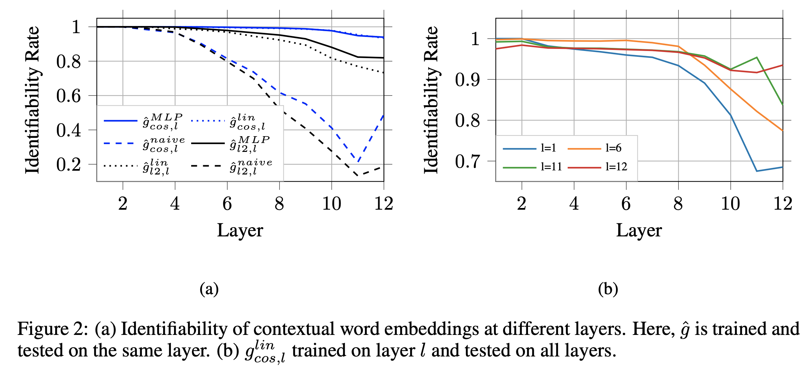
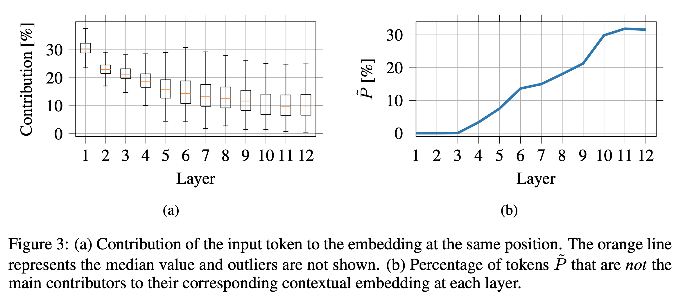
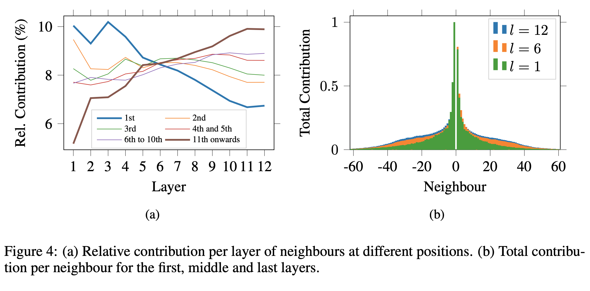

## ON IDENTIFIABILITY IN TRANSFORMERS

### Gino Brunner, Yang Liu, Damian Pascual, Oliver Richter, Massimiliano Ciaramita, Roger Wattenhofer

### Google Research, ICLR, 2020

**Whats New** This paper further deepen understanding of attention weights, and contextual embeddings. It comes up with more reliable attention weights for better interpretibility. Further, it demonstrate tokens are better identifiable with cosine similarity, and dive into what contributes to contextual embeddings and what is lost as part of it.

**Key Concepts**
* Effective Attention:
    * Mathematical proof on how left null space of T, LN(T)can be added into Attention matrix and it would still produce same outcomes.

    * 

    * 

    * LN(T) would be non empty if rank of matrix T is lesser than sequence_legth, and that would be the case when sequence_length is greater than dimensions of attention heads. Which is 64 in BERT.

    * Author propose to remove part of A, which is because of LN(T), to produce effective attention
    

    * They demonstrate that,
        * Pearson coefficient of attention weights vs effective attention goes down when sequence length increases beyond 64.
        * spike in attention weights of "SEP" (in paper what Bert Looks At?) tokens can be reduced to a normal level because of this notion. 

    

        
        <em>Source: Author</em>
        

* Token Identifiability
    * Can we retrive original token using token's contextual weight after layer l by applying lienar transform and nearest neighbour operation?

    

        
        <em>Source: Author</em>
        

    * Above figure demonstrates that "cosine similarity" is better embedded in contextual embeddings, and as layer deepens, identifiability drops because of more mixture of contextual information.

* Token Mixing
    * Contribution of the same input token drops in subsequent layers, and how 30% of tokens becomes no more main contributors of their corresponding contextual embeddings. Figure below:

     

        
        <em>Source: Author</em>
        

    * Relative contribution of farther neighbours increases deeper layers, and total contibution of neighbours follows normal distributions with mean at local. Self explanatory figure below:

    
     

        
        <em>Source: Author</em>
        

* Overall, this paper would contribute to
    * Actually measure contribution of each word to other word
    * Also, ignited, by collapsing left and right transformation matrix can inference be reduced to just two matrix product?

