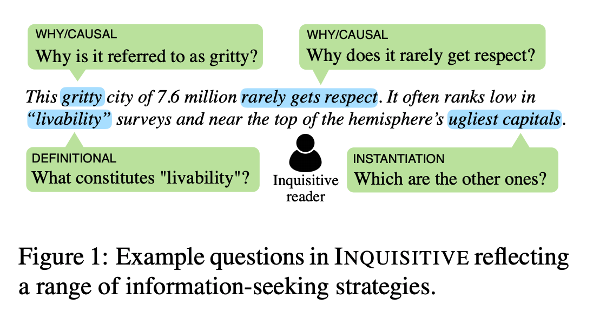
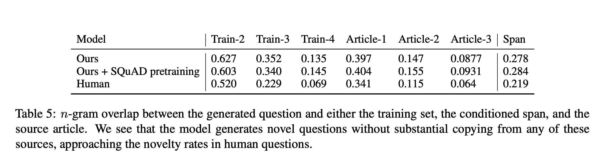
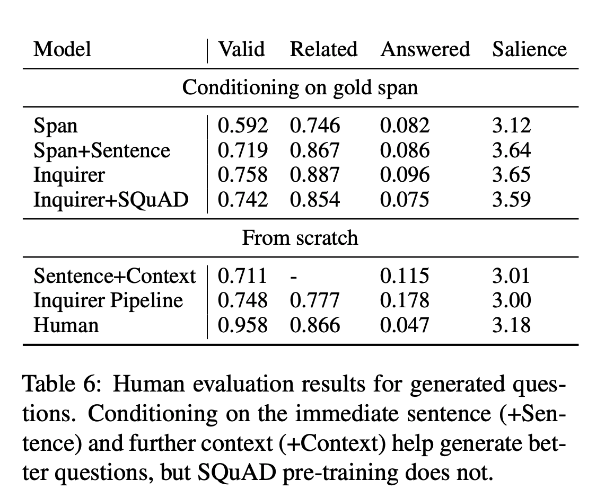

## Inquisitive Question Generation for High Level Text Comprehension.
### Ko, Wei-Jen, Te-Yuan Chen, Yiyan Huang, Greg Durrett, and Junyi Jessy Li. 
### arXiv preprint arXiv:2010.01657 (2020).[[arXiv](https://arxiv.org/pdf/2010.01657.pdf)]

**Whats Unique**
This paper presents novel problem formulation, dataset and a baseline model for inquisitive question generation. Inquisitive question seeks additional information / clarification about the selected span of text. 

**How It Works**
* Following figure illustrate an example of inquisite questions.

    
    <em>Source: Author</em>
    

* Corpus of 19K questions were created as below:
    * 500 articles each of following were selected. 
        * Wall Street Journal portion of the Penn Treebank (Marcus et al., 1993), 
        * Associated Press articles from the TIPSTER corpus (Harman and Liberman, 1993), and 
        * Newsela (Xu et al., 2015), a commonly used source in text simplification 
    * each sentence were given to few annotators.
    * Annotators see sentence one after other, and at every time they can ask about 0 to 3 questions from a given sentence.
    * Crowd sourced questions were further given to the validator/reviewer.

* Since these are inquisitive questions, there are proportionally more questions like "why", "how" in comparison to squad and QuAC and NewsQA datasets.

* Qualititive analysis on what information users are inquiring summarises as below:
    * Why questions
    * Elaboration questions
    * Definition questions
    * Background information questions
    * Instantiation questions
    * Forward looking questions
    
* GPT-2 model was trained in different variants, sentence-span aware, and just span aware. Also Squad finetuned model was also further fine tuned on this dataset.

* Automatic evaluation, where n-gram overlap was used as the metric, and human evaluation (question is valid, or related etc) were used as the metric to compare the performance.

<em>Source: Author</em>

<em>Source: Author</em>

