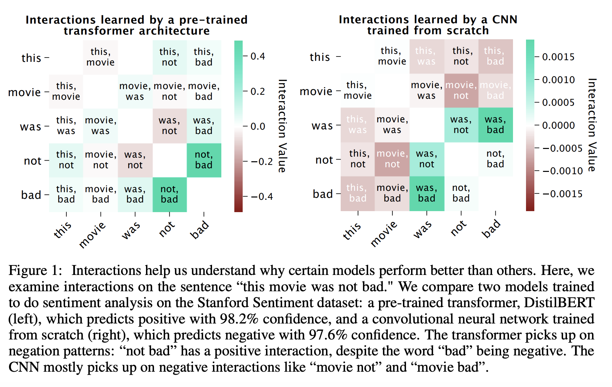

## Explaining Explanations: Axiomatic Feature Interactions for Deep Networks
### Janizek, Sturmfels, Lee, 
### 2020 [[arXiv](https://arxiv.org/pdf/2002.04138.pdf)]

**Whats Unique**
Recently, feature attributions methods explain how much a feature is an important for the model prediction. However, interactions between the features helps us to understand model behavior. Author presents a new technique Integrated Hessians - which is an extension to Integrated Gradients to capture feature interactions for their role in model prediction.

**How It Works**

* Integrated Gradients take the derivate of model output over a feature taking values along a path from baseline to current.

* Integrated hessians is the Integratred Gradients of Integrated Gradients.

And, Integrated hessians satisfies fundamental axioms.
1. Interaction Completeness axiom

2. Self Completeness axiom

- when cross interactions terms are zero, integrated hessians are just the integrated gradients.

* Making RELU work
- Relu has second order derivative all zero. So, inorder to make Integrared Hessians work for RELU, an approximation of RELU, which is SoftPlus can be used.

    

* XOR was explained in the paper by demonstraing how feature interactions are capture by Integrated hessians which could not get captured by Integrated Gradients.

* Examples in NLP domain, where feature interactions are explaining model. 

    

    
    <em>Source: Author</em>
    

    * how adjectives interacts with each other or with noun, and give meaningful attribution
    * when multiple adjectives are modifying nouns it impacts noun's attribution significantly, whereas individual adjectives attribution becomes smaller.

    

    
    <em>Source: Author</em>
    

