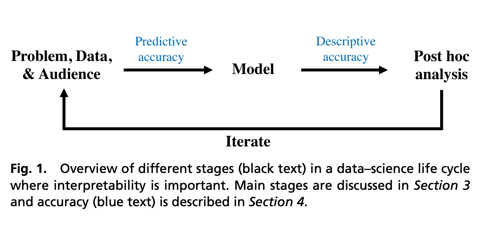
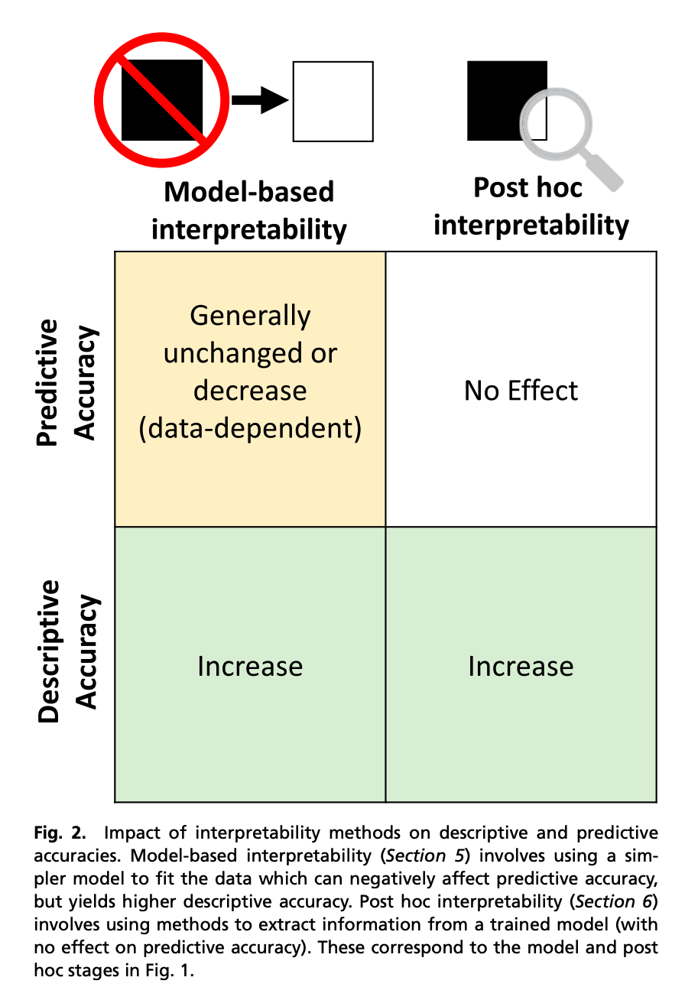

## Definitions, methods, and applications in interpretable machine learning
### W. James Murdocha, Chandan Singhb, Karl Kumbiera, Reza Abbasi-Asl, and Bin Yua
### PNAS 2019 [[PNAS](https://www.pnas.org/content/pnas/116/44/22071.full.pdf)]

**Whats New**
This paper puts a framework on interpretability, and surveys and categorise different techniques available for the same.

**Framework**
    

    
    <em>Source: Author</em>
    

* It proposes PDR framework, which stands for Predictive Accuracy, Descriptive Accuracy and Relevance.
* PDR framework categorise intrepretability into two differnt ways, 1) Model based interpretability, 2) Post hoc interpretability

    
    <em>Source: Author</em>
    

**Predictive Accuracy**
* In context of interpretation, degree to which an interpretation method objectively captures the underlying relationships of data. 
* Data used to check predictive accuracy must resemble the population of interest.
* Predictive accuracy should be stable with data and model pertuburation
**Descriptive Accuracy**
* In context of interpretation, degree to which an interpretation method objectively captures the relationships learned by machine learning models.
**Relevance**
* Iterpretation is said to be relevant if it provides the insight for a particular audience into a chosen domain problem.

**Conflict**
* On the one hand, the simplicity of model-based interpretation methods yields consistently high descriptive accuracy, but can sometimes result in lower predictive accuracy on complex datasets. 
* On the other hand, in complex settings such as image analysis, complicated models can provide high predictive accuracy, but are harder to analyze, resulting in a lower descriptive accuracy

**Model Based Interpretability**
We define model-based interpretability as the construction of models that readily provide insight into the relationships they have learned. Common types of methods for model based interpretability are
* Sparsity: 
    * Underlying relationships is based on the sparse set of signals. The practitioners can impose sparsity of the model by limiting the number of non-zero parameters. When numbers of non-zero parameters are relatively smaller, practitioners can interpret the variables corresponding to those parameters as being meaningfully related to the outcome, hence interpret magniture and direction of these parameters. 
    * Stability of these parameters needs to be checked.
    * examples: LASSO, sparse coding, AIC, BIC etc
* Simulatability:
    * A model is simulatable if human is able to interally simulate and reason about its entire decision making process. 
    * Example decision trees. 
    * Rules learned by such model may not be highly stable. If practitioners wants to understand a model on how predictions are made, this is a good choice, but if want to learn knowledge of underlying data, then these rules may not be stable enough, and changes with respect to small changes in the data.
* Modularity
    * ML model is defined modular if the prediction process can be interpreted independently in modules. i.e. Probablistic models are modular by specifying conditional independence. 
    * Model for mortality prediction of pneumonia. It was modelled as additive model of pairwise interaction. And, fitted model showed association that asthama patient has lower risk of pneumonia, however reverse is true. It could be figured out as implemented model was modular, and actual cause of this was that asthama patients were already undergoing medication.
* Domain based feature engineering
    * Having more informative features eases the learning of needed relationships by model.
    * E.g. Ice vs water prediction from satellite image. Just 3 simple featurs have made it possible.
    * tf-idf features, ratios for BMIs etc are good examples
* Model based feature engineering
    * unsupervised learning, and dimesionality reduction to come up with model based features.

**Post-Hoc Interpretability**
* Interpreting what insights or relationships model parameters have learned. 
* Its challanging, when model parameters can not be directly interpreted, the information needs to be extracted from model parameters, and an explorative analsis needs to be done.
* Under PDR framework, at this stage, predictive accuracy is fixed, a researcher must think to improve descriptive accuracy and relevance.
* Two types of information
    * Prediction level information (local interpretations)
    * Dataset level information (global relationship learned by model)
* Dataset level information
    * Feature importance and interactions: i.e. boolean interactions in random forests
    * Statastical feature importance: i.e. confidence interval, associations vs causation
    * Visulations 
* Prediction level information
    * Feature importance score - saliencey maps,    
    * Alternative to feature importance - i.e. when model itself learns the interactions between features. i.e. influential data points, analysing neareset neighbours etc.

    
