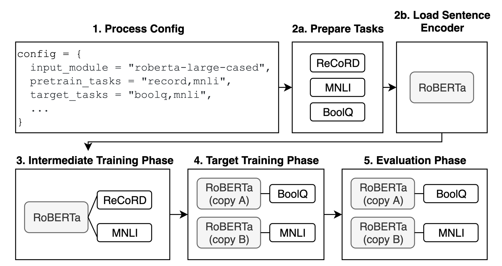

## jiant: A Software Toolkit for Research on General-Purpose Text Understanding Models

### Yada Pruksachatkun, Phil Yeres, Haokun Liu, Jason Phang, Phu Mon Htut, Alex Wang, Ian Tenney, Samuel R. Bowman

### New York University, Google Research

* jiant is an open source toolkit for NLP
* It is mainly aimed for research community for ease of use, reproducibility, availability of NLU tasks, and availability of cuttinge edge models.
* It supports 
    * huggigface models and AllenNLP
    * more than 50 NLP/NLU tasks
    * CLI and configuration based user interface 
    * standard pipeline, process config -> Prepare Tasks -> Load Model (or Sentence Encoder as jiant mentions) -> Intermediate Training -> Target Training -> Evaluation
        

        
        <em>Source: Author</em>
        

* Jiant has following advance support for optimization
    * checkpointing
    * caching
    * gradient accumulation and multi-GPU
    * format for GLUE and SuperGLUE submission
    * tensorboard events files
* Jiant follows ["black"(https://github.com/psf/black)] guidelines for python coding standard.    