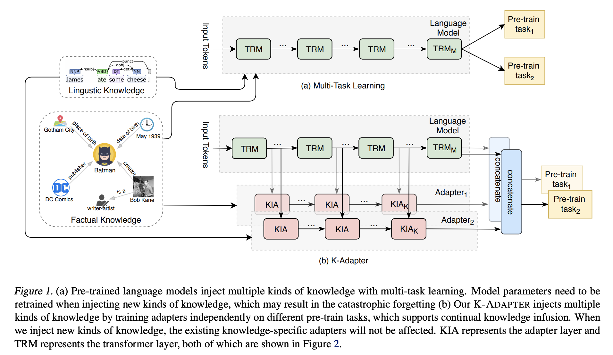
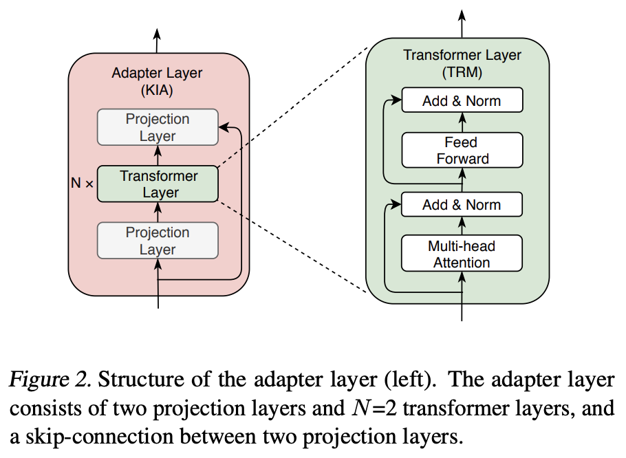

## K-ADAPTER: Infusing Knowledge into Pre-Trained Models with Adapters
### Ruize Wang, Ming Zhou et al.
### Feb, 2020 [[arXiv](https://arxiv.org/pdf/2002.01808.pdf)]

**Whats New**
This paper proposes a technique to extend language model with supplimentory adapters, where different kinds of knowledge can be infused. It avoids catastrophic forgetting and provide an dis-entangled representations.

**Major Contribution**
* K-Adapter: an approach that support continual knowledge infusion into large pre-trained models.
* Infuse factual and linguistic knowledge and show that adapters for both kinds of knowledge works well on downstream tasks.
* Validates performance on K-Adapters by three downstream tasks.

**How It Works**
* Following figure illustrate the approach and architecture diagram.
    

    
    <em>Source: Author</em>
    

* Structure of adapter layer consists of N transformers layers and two projection layers.
    

    
    <em>Source: Author</em>
    

* **Factual Adapter**
    * Subset from TREx, a collection of sentences where surface form of the relation appears. 430 relations, and 5.5 millions sentences.
    * Pre-training objective of relationship classification task, given two entities.
* **Linguistic Adapter**
    * Dependency parser on a book corpus of 1M examples. 
    * Pre-training objective of dependency relation prediction, which aims to predict the father index for each token. 
* Experiments
    * K-Adpaters are evaluated on three downstream tasks. Entity Typing, Question Answering, and Relation Classification. 
    * Entity Typing
        * Special token "@" is added before and after certain entity. 
        * First special token "@" is adopted to perform classification.
        * K-Adapters (F+L) brings about 2%+ improvement in comparison to state of the art.
    * Quetion Answering:
        * Input sequence is modified as "<SEP>Context</SEP>Question</SEP>answer</SEP>", and first <SEP> token was used for classification.
        * K-Adapter (F+L) performed better.
    * Relation Classification:
        * TACRED dataset, which covers 42 relationships is used.
        * Special token "@" before and after first entity, and special token "#" before and after second entity. and token representation from first "@" and first "#" concatenated to perform relationship classification.
    * Knowledge Probing
        * Factual knowledge was probed by masking the knowledge information, and predict the mask token.
        i.e. iPod Touch is produced by [MASK].

    