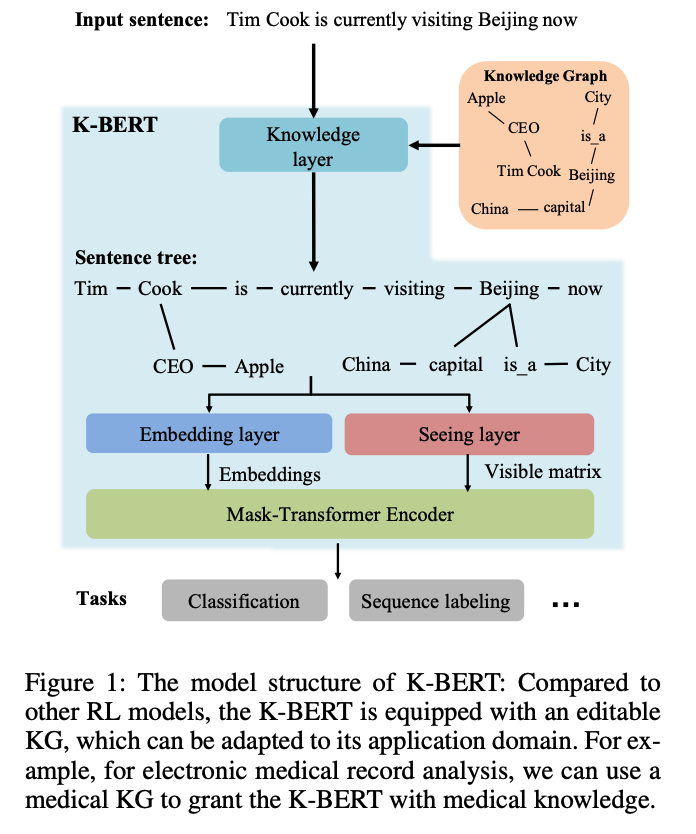
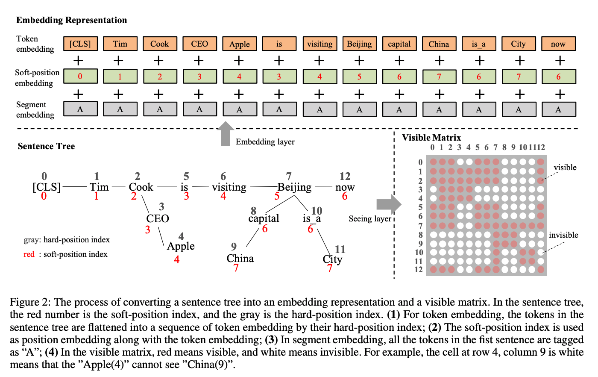

## K-BERT: Enabling Language Representation with Knowledge Graph
### Weijie Liu, Peng Zhou, Zhe Zhao, Zhiruo Wang, Qi Ju, Haotang Deng, Ping Wang, 
### AAAI 2020 [[arXiv](https://arxiv.org/pdf/1909.07606.pdf)]

**Whats New**
It presents an approach to infuse knowledge graph at self attention level, so that knowledge graph embeddings and language model embeddings becomes homogeneous in nature.

**How it works**
* Following few figures illustrates the clean and profound approach

    
    <em>Source: Author</em>
    

 

    
    <em>Source: Author</em>
    

* It solves two problems of infusing KG with language modeling
    * Hetrogeneous Embedding Space: Embedding vectors of KG space and words in text differen in their representation space.
    * Knowledge Noise: Too much knowledge incorporation can divert the meaning of the sentence.

* As shown in the figure
    * Tree structure is derived from the input sentence by incorporating knowledge graph
    * It has soft-position embedding, which is the least posion based on the tree structure of the input sentence.
    * Only tokens or words in a same branch can see other tokens. That would prevent unnecessary knowledge incorporation
    * And, KG and Words embeddings are getting trained at the same time.
    * Mask-transformer would ensure the attention matrix is turned off for the token pairs which are not supposed to see each other.

* Results
    * On, many chinese text classification tasks, it has improved the results.

    