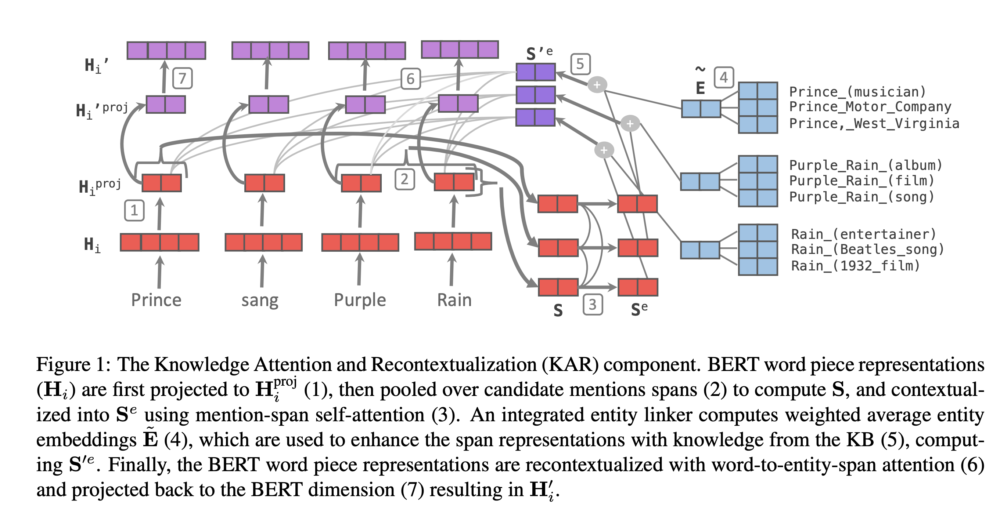

## KnowBERT: Knowledge Enhanced Contextual Word Representations
### Peters et al
### ACL 2019

**Whats New** It proposes a general method to embed multiple knowledge bases into large scale models, and thereby, enhance their representations with structured human knowledge. For embedding each KB, (1) first use an integrated entity linker to retrieve relevant entity embeddings, and then (2) update contextual word representation using word to entity attention.

**How It Works**
* Following diagram illustrate the complete picture in detail.

    
    <em>Source: Author</em>
    

* Mention-span representations
    * Project H_i to entity dimension using a linear projection

        

    * Pool all wordpieces in mention span using self attentive span pooling, to derive S.

* Entity Linker
    * Mention-span self attention

        

    * Candidates entities are chosen from KB, each candidate span m has 
        - an associated mention span representation s_m^e
        - M_m candidate entities with word embeddings e_mk and prior probabilities p_mk

            

        - At this stage if gold labels are available, i.e. for a given mention-span, if we know gold entitiy, then a loss function (log liklihood and max margin)

            

* Knowledge Enhanced Entity-Span Representation
    * \psi_mk represent similarity between mention span and entity embedding. Disregard all the entities where \psi_mk is less than threshold.

        

    * Weighted entity embeddings are computed as follow:

        

    * Finally, entity span representations are updated using weighted entity embeddings.

        

* Recontextualization
    * Using attention mechanism, where projected mention span represnetations are taken as query, and entitiy span representations are taken as key and value, and KB contexulised mention span are computed as below:

        

* Projected back to BERT dimensions
    * Inverse of weight matrix which projected BERT embeddings to entity dimensions are used here.

        

* Loss function of KnowBERT is 

    

* Multiple KBs can be added to BERT starting from lower layers to higher layers. 

* Results, KnowBERT has shown better results in both intrinsic and extrinsic evaluation, i.e. better than ERNIE and Soares 2019 knowledge based LMs. 

**Reflection**
Techniques to infuse knowledge base embeddings to BERT kind of language model is growing traction. It can really make Langauge Models knowledge aware, which can impact downstream tasks.

    

